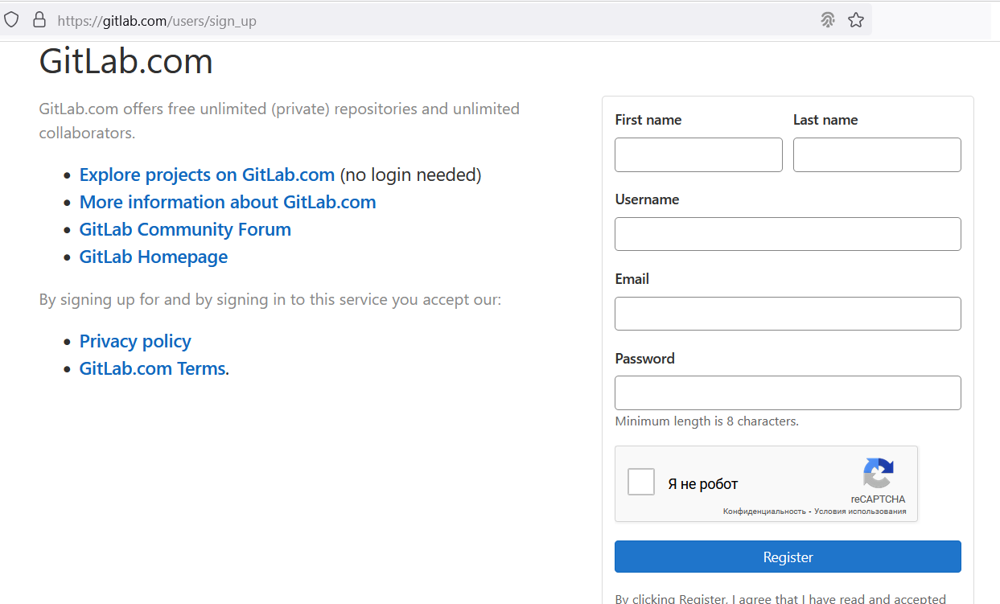

# ЛР 01. Реєстрація на Github та створення репозиторію

## Перелік
1. [Реєстрація на Github та створення репозиторію](lab-01.md)
2. [Встановлення та налаштування клієнту СКВ Git](lab-02.md)
3. [Клонування репозиторію засобами Git for Windows](lab-03.md)
4. [Додавання файлв у репозиторій на Github ](lab-04.md)
5. [Внесення змін до репозиторію](lab-05.md)
6. [Створення репозиторію для власних лабораторних робіт](lab-06.md)
7. [Командна робота над проектом на Github ](lab-07.md)
8. [Створення та видалення тегів](lab-08.md)
9. [Робота з історією змін та отримання старих версій](lab-09.md)
10. [Відміна індексованих змін та фіксацій](lab-10.md)
11. [Створення гілок та навігація у розгалуженному проекті](lab-11.md)
12. [Зміни у гілці master. Злиття гілок](lab-12.md)
13. [Штучне створення конфлікту та його вирішення](lab-13.md)
14. [Робота з графічним клієнтом TortoiseGit](lab-14.md)
15. [Робота з графічним клієнтом Github](lab-15.md)
16. [Встановлення та налаштування клієнту СКВ Subversion](lab-16.md)
17. [Робота з репозиторієм в консольному режимі TortoiseSVN](lab-17.md)
18. [Робота з версіями в TortoiseSVN](lab-18.md)
19. [Робота з репозиторієм в IDE Netbeans](lab-19.md)
20. [Створення репозиторію для дипломного проекту](lab-20.md)

## Мета роботи

Отримати навички створення профілю на Github та створення власних репозиторіїв

## Обладнання

Персональний комп'ютер. Текстовий редактор Sublime Text 3 або Notepad++. Web-браузер Chrome, Firefox, Opera

## Хід роботи

1.  Створити обліковий запис на Github.com 
2.  Створити власний репозиторій, додавши у нього файл README.md
3.  Створити обліковий запис на GitLab.com 
4.  Створити власний репозиторій, додавши у нього файл README.md
5.  Створити обліковий запис на Bitbucket.org
6.  Порівняти інтерфейс та функції обох систем. Виявити спільні та відмінні риси, додати порівняння у звіт в довільній формі
7.  Створити форк (копію) будь-якого репозиторію на Github.com
8.  Для кожного етапу роботи зробити знімки екрану та додати їх у звіт з описом кожного скіншота
9.  Дати відповіді на контрольні запитання
10.  Зберегти звіт у форматі PDF

## Контрольні питання

1.  Що таке система контролю (управління) версій?
2.  Які СКВ ви знаєте?
3.  Які можливості надають Gihub, Gitlab та Bitbucket?
4.  Які дії неохідно виконати для створення репозиторію Gihub?
5.  Які дії неохідно виконати для створення репозиторію Bitbucket?
6.  Як ви розумієте термін Fork?

## Довідники та додаткові матеріали

1.  [Git офіційний сайт](https://git-scm.com/)
2.  [Git офіційна документація](https://git-scm.com/doc)
3.  [Сторінка завантаження Git](https://git-scm.com/downloads)
4.  [Офіційна документація GitHub](https://docs.github.com/en)
5.  [Офіційна документація GitLab](https://docs.gitlab.com/)
6.  [Офіційна документація Bitbucket](https://bitbucket.org/product/guides)

