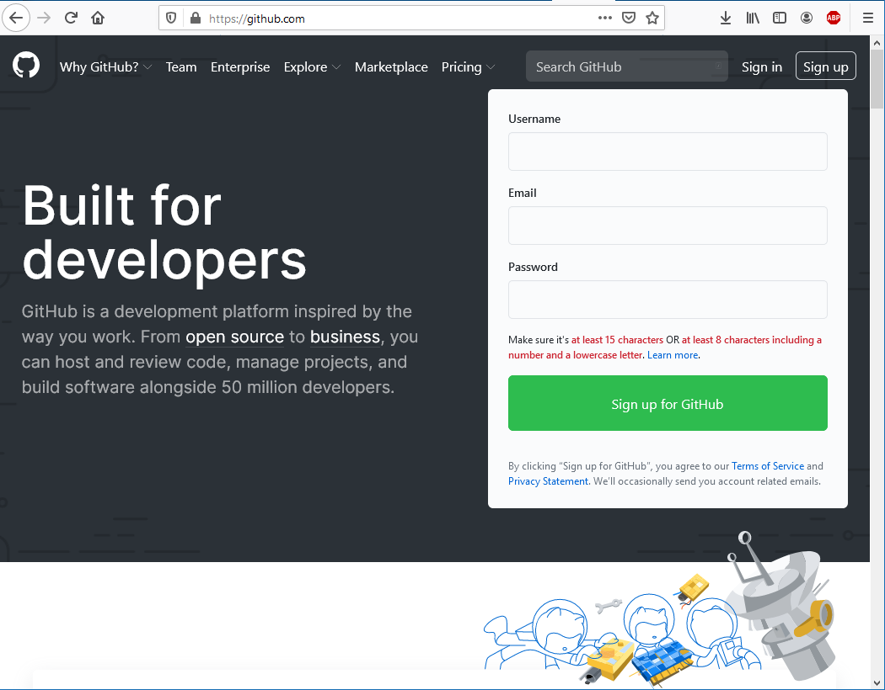
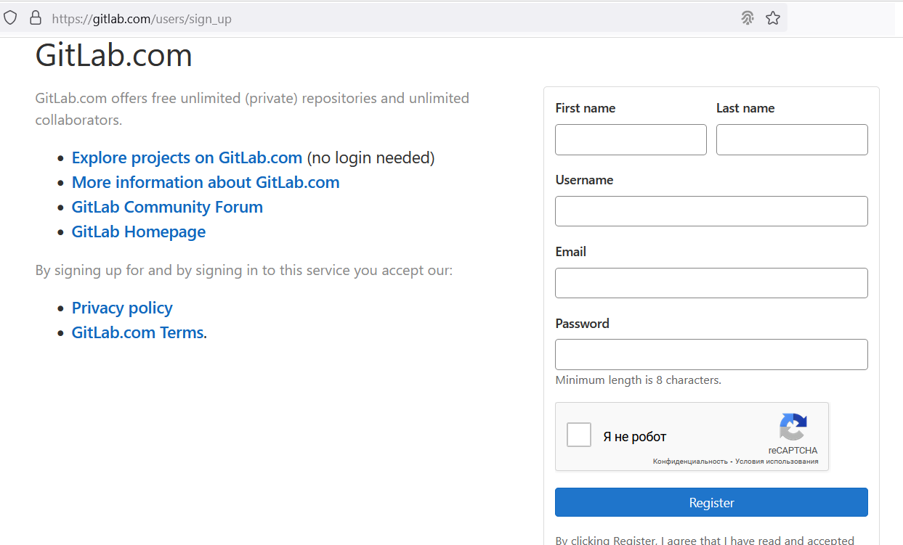

# Лабораторна робота №1. Реєстрація на Github та створення репозиторію

[Перелік усіх робіт](README.md)

## Мета роботи

Отримати навички створення профілю на Github та створення власних репозиторіїв

## Обладнання

Персональний комп'ютер. Текстовий редактор Sublime Text 3 або Notepad++. Web-браузер Chrome, Firefox, Opera

## Хід роботи

1.  Створити обліковий запис на Github.com 
2.  Створити власний репозиторій, додавши у нього файл README.md
3.  Створити обліковий запис на GitLab.com 
4.  Створити власний репозиторій, додавши у нього файл README.md
5.  Створити обліковий запис на Bitbucket.org
6.  Порівняти інтерфейс та функції обох систем. Виявити спільні та відмінні риси, додати порівняння у звіт в довільній формі
7.  Створити форк (копію) будь-якого репозиторію на Github.com
8.  Для кожного етапу роботи зробити знімки екрану та додати їх у звіт з описом кожного скіншота
9.  Дати відповіді на контрольні запитання
10.  Зберегти звіт у форматі PDF

## Контрольні питання

1.  Що таке система контролю (управління) версій?
2.  Які СКВ ви знаєте?
3.  Які можливості надають Gihub, Gitlab та Bitbucket?
4.  Які дії неохідно виконати для створення репозиторію Gihub?
5.  Які дії неохідно виконати для створення репозиторію Bitbucket?
6.  Як ви розумієте термін Fork?

## Довідники та додаткові матеріали

1.  [Git офіційний сайт](https://git-scm.com/)
2.  [Git офіційна документація](https://git-scm.com/doc)
3.  [Сторінка завантаження Git](https://git-scm.com/downloads)
4.  [Офіційна документація GitHub](https://docs.github.com/en)
5.  [Офіційна документація GitLab](https://docs.gitlab.com/)
6.  [Офіційна документація Bitbucket](https://bitbucket.org/product/guides)

