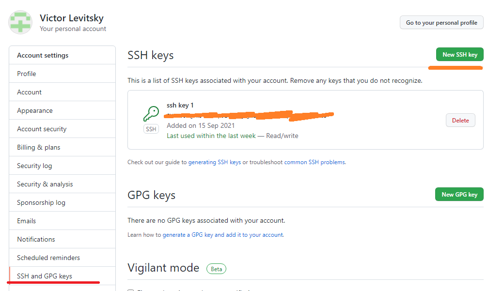

# Лабораторна робота №2. Встановлення та налаштування клієнту СКВ Git

[Перелік усіх робіт](README.md)

## Мета роботи

Отримати навички встановлення та налаштування програмного забезпечення для роботи з СКВ Git

## Теоретичні відомості

### Налаштування Git

До Git входить утиліта що має назву `git config`, яка дозволяє отримати чи встановити параметри, що контролюють усіма аспектами того, як Git виглядає чи працює. Ці параметри можуть бути збережені в трьох різних місцях:

* Файл `/etc/gitconfig` містить значення для кожного користувача в системі і всіх їхніх репозиторіїв. Якщо ви передаєте опцію `--system` при виконанні `git config`, параметри читаються та пишуться з цього файлу. (Це системний файл конфігурації, відповідно, вам потрібен був доступ адміністратора чи суперкористувача, щоб змінювати його.). У системах Windows, Git шукає файл /etc/gitconfig, відносно кореня MSys, котрий знаходиться там, де ви вирішили встановити Git у вашій Windows системі, коли ви запускали інсталяцію.

* Файл `~/.gitconfig` або `~/.config/git/config` зберігає значення саме для вас — користувача. Ви можете налаштувати Git читати і писати в цей файл, вказуючи опцію `--global`. У системах Windows, Git шукає файл .gitconfig в каталозі $HOME (C:\Users\$USER для більшості користувачів). 

* Файл `config` у каталозі Git (тобто `.git/config`) у тому репозиторії, який ви використовуєте в даний момент, зберігає налаштування конкретного репозиторія.

Кожен рівень має пріоритет над налаштуваннями в попередньому рівні, тобто параметри в .git/config перевизначають параметри в /etc/gitconfig.


Якщо ви хочете подивитися на свої налаштування, можете скористатися командою `git config --list`, щоб переглянути всі налаштування, які Git може знайти:

```bash
$ git config --list
user.name=John Doe
user.email=johndoe@example.com
color.status=auto
color.branch=auto
color.interactive=auto
color.diff=auto
...
```


### SSH для обміну даними в системах Github, Gitlab, Bitbucket

Під час налаштування ключа SSH створюється пара ключів, яка містить приватний ключ (збережений на локальному комп’ютері) та відкритий ключ (завантажений на сервіси Github, Gitlab, Bitbucket). Сервіс використовує пару ключів для автентифікації будь-якого доступу до відповідного облікового запису. Цей двосторонній механізм запобігає атакам на калан зв’язку.

## Хід роботи

1. За допомогою пошукової системи знайти сторінку завантаження Git for Windows
2. Завантажити інсталяційний файл Git for Windows відповідно до своєї операційної системи

Якщо у вас встановлено ОС відмінну від сімейства Windows, то необхідно остановити відповідний пакет

||
|:--:|
|Сторінка завантаження Git|

3. Увійти в систему Windows з правами адміністратора
4. Встановити Git for Windows
5. Налаштувати глобальну конфігурацію Git for Windows за допомогою консолі git bash
```bash
$ git config --global user.name "Your Name"
$ git config --global user.email "your_email@whatever.com"	
```
6. Клонувати створений раніше репозиторій на Github як локальну робочу копію
```bash
$ mkdir dir_for_git
$ cd dir_for_git
$ git clone https://github.com/my_name/my_repo
```
7. Способом аналогічним до попереднього пункту клонувати створений раніше репозиторій на Bitbucket як локальну робочу копію
8. Для закріплення клонувати створений раніше репозиторій на Gitlab як локальну робочу копію
9. Створити публічний ключ SSH для з'єднання з Github по протоколу SSH. Для цього необхідно використати генератор ключів.
```bash
$ ssh-keygen -t key_type -C "your_email@example.com"
```
10. Впевнитися, що файли `key_name` та `key_name.pub` знаходяться в директорії для ключів за замовчуванням `/home/user_name/.ssh` (для Unix) або `C:/Users/user_name/.ssh` (для Windows)

Публічний ключ (зміст файлу `key_name.pub`) скопіювати у форму на Github для збереження за посиланням `https://github.com/your_name/keys`


11. Для використання SSH-з'єднання з Github необхідно запустити агента аутентифікації SSH та додати згенерований ключ.
```bash
$ eval "$(ssh-agent -s)"
$ ssh-add ~/.ssh/key_name
```
12. Виконати клонування репозиторію за допомогою SSH-з'єднання
```bash
$ git clone git@github.com:solidol/NMKD_SYSPROG.git		
```	
Можна обрати інший репозиторій. Посилання на завантаження по SHH-каналу знаходиться на стартовій сторінці репозиторію - меню "Code", вкладка "SSH".

13. Для кожного етапу роботи зробити знімки екрану або скопіювати текст консолі та додати їх у звіт з описом кожного скіншота
14. Дати відповіді на контрольні запитання
15. Зберегти звіт у форматі PDF

## Контрольні питання

1. Де скачати клієнт Git для Windows?
2. Якою командою клонувати репозиторій з Github?
3. Які які ще способи завантаження репозиторію з Github ви знаєте?
4. Яким чином обрати на Github налаштування приватності репозиторію?
5. Яким чином обрати на Bitbucket налаштування приватності репозиторію?

## Довідники та додаткові матеріали

1. [Github](https://github.com/)
2. [Gitlab](https://gitlab.com/)
3. [Bitbucket.org](https://bitbucket.org/)
4. [Документація Github](https://docs.github.com/)
5. [Генерація вашого публічного ключа SSH](https://git-scm.com/book/uk/v2/Git-%D0%BD%D0%B0-%D1%81%D0%B5%D1%80%D0%B2%D0%B5%D1%80%D1%96-%D0%93%D0%B5%D0%BD%D0%B5%D1%80%D0%B0%D1%86%D1%96%D1%8F-%D0%B2%D0%B0%D1%88%D0%BE%D0%B3%D0%BE-%D0%BF%D1%83%D0%B1%D0%BB%D1%96%D1%87%D0%BD%D0%BE%D0%B3%D0%BE-%D0%BA%D0%BB%D1%8E%D1%87%D0%B0-SSH) 
6. [Fork a repo](https://docs.github.com/en/get-started/quickstart/fork-a-repo)