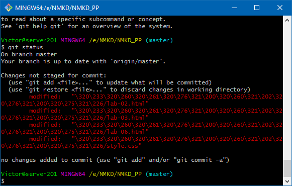

# Лабораторна робота №4. Додавання файлів у репозиторій на GitHub

[Перелік усіх робіт](README.md)

## Обладнання

Персональний комп'ютер. Текстовий редактор Sublime Text 3 або Notepad++. Web-браузер Chrome, Firefox, Opera, Internet Explorer, Git for Windows

## Мета роботи

Отримати навички внесення змін до локальної робочої копії та репозиторію на GitHub

## Теоретичні відомості

## Хід роботи

1. Перевірити глобальні налаштування Git for Windows
2. Клонувати створені раніше репозиторії як локальні робочі копії з GitHub та Bitbucket
3. Порівняти зміст локальної робочої копії та репозиторію на GitHub та Bitbucket, впевнитись що зміст співпадає
4. Додати файли до локальних робочих копій репозиторіїв
5. Перевірити статус локальних робочих копій командою `git status`

    ||
    |:--:|
    |Перевірка статусу локальних робочих копій|

6. Додати до індексу локальних робочих копій нові файли командою `git add`

    ```bash
    git add file1
    git add file2   
    ```

7. Перевірити статус локальних робочих копій та у випадку відсутності непроіндексованих файлів виконати операцію фіксації (комміту) командою `git commit`

    ```bash
    git commit -m "Message for commit"   
    ```

8. Роботу з репозиторіями можна проводити по-черзі, або в різних консолях
9. Вивантажити файли на GitHub, GitLab та Bitbucket командою `git push`

    ```bash
    git push   
    ```

10. Перевірити наявність нових файлів на GitHub, GitLab та Bitbucket через web-інтерфейс
11. За допомогою web-інтерфейсу додати файл до репозиторіїв
12. Актуалізувати локальні робочі копії та порівняти їх зміст зі змістом репозиторіїв через їх web-інтерфейси
13. Створити кілька файлів та додати їх до проіндексованих файлів однією командою.
14. Зафіксувати зміни та вивантажити їх у репозиторій на GitHub.
15. За допомогою документації вияснити, яким чином виконується видалення файлів з репозиторію. Виконати видалення файла.
16. Зафіксувати зміни та вивантажити їх у репозиторій на GitHub.
17. За допомогою документації вияснити, яким чином виконується перейменування файлів в репозиторії. Виконати видалення файла.
18. Зафіксувати зміни та вивантажити їх у репозиторій на GitHub.
19. Для кожного етапу роботи зробити знімки екрану або скопіювати текст консолі та додати їх у звіт з описом кожного скіншота
20. Дати відповіді на контрольні запитання
21. Зберегти звіт у форматі PDF

## Контрольні питання

1. Яка команда відповідає за фіксацію змін в локальному репозиторії?
2. Який синтаксис має команда фіксації змін? Що необхідно вказати обов'язково?
3. Якою командою можна вивантажити файли на GitHub чи Bitbucket?
4. Яким чином в консолі перемкнутись з одного репозиторію на інший?
5. Що робить команда `git add?`
6. Що робить команда `git rm?`

## Довідники та додаткові матеріали

1. [Основи Git - Запис змін до репозиторія](https://git-scm.com/book/uk/v2/Основи-Git-Запис-змін-до-репозиторія)
2. [Основи роботи з Git. Базові команди](https://hyperhost.ua/info/ru/osnovyi-rabotyi-s-git-bazovyie-komandyi)
3. [Переміщення файлів Git](https://githowto.com/ru/moving_files)
4. [Перегляд історії комітів](https://git-scm.com/book/uk/v2/%D0%9E%D1%81%D0%BD%D0%BE%D0%B2%D0%B8-Git-%D0%9F%D0%B5%D1%80%D0%B5%D0%B3%D0%BB%D1%8F%D0%B4-%D1%96%D1%81%D1%82%D0%BE%D1%80%D1%96%D1%97-%D0%BA%D0%BE%D0%BC%D1%96%D1%82%D1%96%D0%B2)
5. [Отримання допомоги](https://git-scm.com/book/uk/v2/%D0%92%D1%81%D1%82%D1%83%D0%BF-%D0%9E%D1%82%D1%80%D0%B8%D0%BC%D0%B0%D0%BD%D0%BD%D1%8F-%D0%B4%D0%BE%D0%BF%D0%BE%D0%BC%D0%BE%D0%B3%D0%B8)
