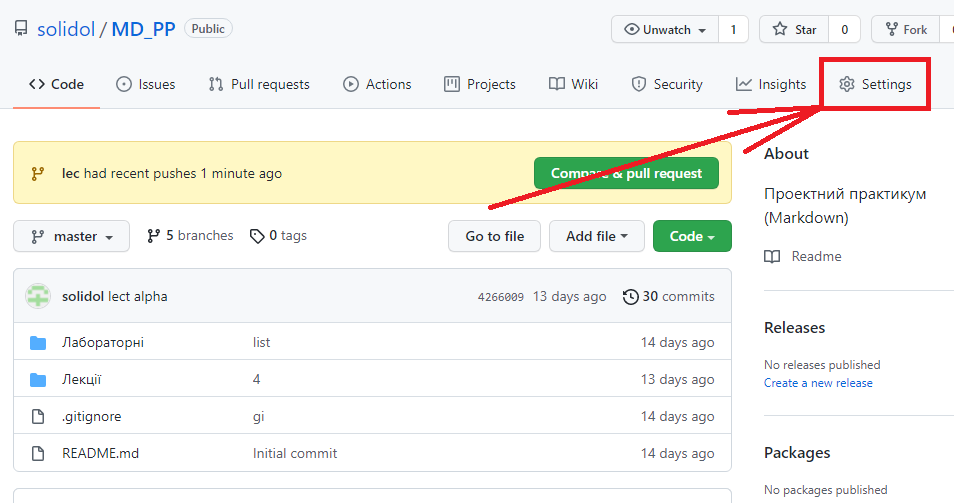
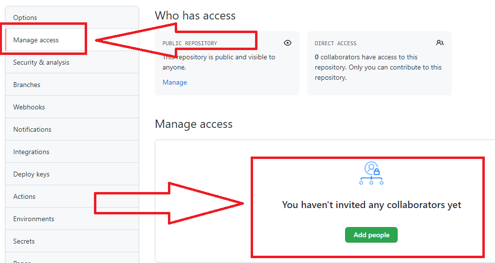
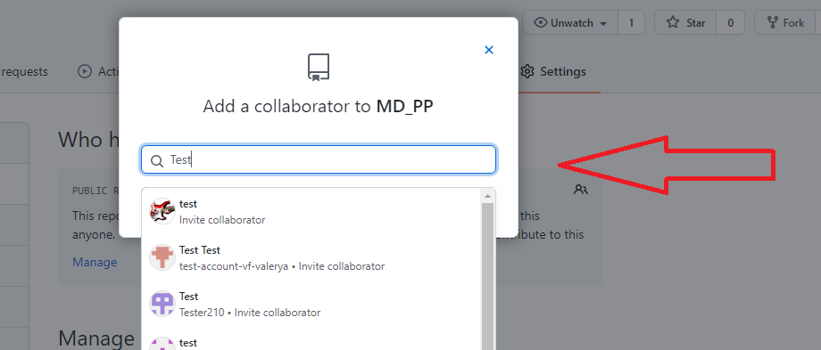

# Лабораторна робота №7. Командна робота над проектом на GitHub

[Перелік усіх робіт](README.md)

## Мета роботи

Отримати навички роботи в команді репозиторіями на GitHub

## Обладнання

Персональний комп'ютер. Текстовий редактор Sublime Text 3 або Notepad++. Web-браузер Chrome, Firefox, Opera, Internet Explorer, Git for Windows

## Пояснення до роботи

Дана лабораторна робота проводиться групами в два або більше здобувача освіти

## Хід роботи

1. Створити робочу групу з двох-трьох учасників
2. Додати через веб-інтерфейс GitHub соавтора (колаборатора) до свого репозиторію

   |  |
   | :------------------: |
   |          1           |

   |  |
   | :------------------: |
   |          2           |

   |  |
   | :------------------: |
   |          3           |

3. Додати через веб-інтерфейс Bitbucket соавтора (колаборатора) до свого репозиторію
4. Прослідкувати, щоб інші учасники вашої робочої групи додали ваш обліковий запис до своїх репозиторіїв
5. Клонувати репозиторій, до якого вас додали як соавтора
6. Внести зміни до локальної робочої копії даного репозиторію
7. Якщо необхідно, додати нові файли до репозиторію
8. Проїндексувати та зафіксувати внесені зміни
9. Вивантажити локальну робочу копію на GitHub
10. Вивантажити локальну робочу копію на BitBucket
11. Перевірити наявність змін у репозиторії на GitHub через web-інтерфейс
12. Розробити один звіт на команду з описом дій всіх учасників
13. Для кожного етапу роботи зробити знімки екрану або скопіювати текст консолі та додати їх у звіт з описом кожного скіншота
14. Дати відповіді на контрольні запитання
15. Зберегти звіт у форматі PDF
16. Завантажити збережений PDF у репозиторій для лабораторних робіт

## Контрольні питання

1. Які дії необхідно виконати, щоб додати співавтора на GitHub?
2. Які дії необхідно виконати, щоб додати співавтора на Bitbucket?
3. Опишіть порядок роботи команди над одним файлом репозиторію
4. Які дії необхідно виконати, щоб видалити співавтора на GitHub?
5. Які дії необхідно виконати, щоб видалити співавтора на Bitbucket?

## Довідники та додаткові матеріали

1. [Командна робота в Git](https://habr.com/ru/post/75990/)
2. [Робота в команді з використанням Git](https://www.blend4web.com/doc/ru/git_short_manual.html)
3. [Спільна розробка в команді на GitHub](https://code.tutsplus.com/ru/articles/team-collaboration-with-GitHub--net-29876)
4. [Додати соавтора до свого репозиторія на Bitbucket](https://learntutorials.net/ru/bitbucket/topic/8102/%D0%B4%D0%BE%D0%B1%D0%B0%D0%B2%D0%B8%D1%82%D1%8C-%D1%81%D0%BE%D0%B0%D0%B2%D1%82%D0%BE%D1%80%D0%BE%D0%B2-%D0%B2-%D1%80%D0%B5%D0%BF%D0%BE%D0%B7%D0%B8%D1%82%D0%BE%D1%80%D0%B8%D0%B9)
5. [Основи роботи з Bitbucket](https://bitbucket.org/product/ru/guides/basics/four-starting-steps#step-1-put-your-code-in-bitbucket)
