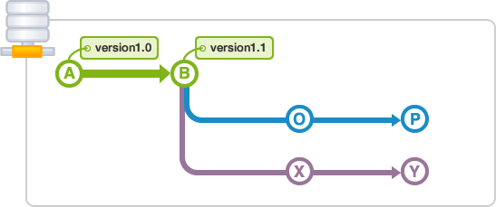

# Лабораторна робота №8. Створення та видалення теґів

[Перелік усіх робіт](README.md)

## Мета роботи

Отримати навички додавання теґів до ревізій проекту в СКВ Git.

## Теоретичні відомості

### Теґи в системі Git

СКВ, Git дозволяє поставити теґ на окремому моменті історії, що чимось видатний. Зазвичай ця функціональність використовується щоб позначити релізи (v1.0 тощо).

Хоча тег може виглядати схожим на гілку, тег, однак, не змінюється як гілка. Він вказує безпосередньо на конкретну фіксацію (Комміт) в історії і не зміниться, якщо не буде явно оновлений.


Git підтримує два головних типи теґів: легкі та анотовані.

Отримати список доступних теґів у Git можна за допомогою команди `git tag` (з опціональним `-l` чи `--list` або без них):

```bash
$ git tag
v0.1
v1.3
```

Ця команда виводить список теґів в алфавітному порядку.

Ви також можете шукати теґи, що відповідають певному шаблону. Наприклад, сховище Git містить більш ніж 500 теґів. Якщо вас цікавлять виключно версії 1.8.5, ви можете виконати:

```bash
$ git tag -l "v1.8.5*"
v1.8.5
v1.8.5-rc0
v1.8.5-rc1
v1.8.5-rc2
v1.8.5-rc3
v1.8.5.1
v1.8.5.2
v1.8.5.3
v1.8.5.4
v1.8.5.5
```

Створити анотований теґ у Git просто. Найлегший спосіб — додати `-a` до команди `git tag`:

```bash
$ git tag -a v1.4 -m "моя версія 1.4"
$ git tag
v0.1
v1.3
v1.4
```

Ви можете побачити дані теґу та коміт, на який він вказує, за допомогою команди `git show`:

```bash
$ git show v1.4
tag v1.4
Tagger: Ben Straub <ben@straub.cc>
Date:   Sat May 3 20:19:12 2014 -0700

my version 1.4

commit ca82a6dff817ec66f44342007202690a93763949
Author: Scott Chacon <schacon@gee-mail.com>
Date:   Mon Mar 17 21:52:11 2008 -0700

    changed the version number
```

Це показує інформацію про автора теґу, дату створення теґу, та повідомлення перед інформацією про коміт.


Другий спосіб позначати коміти — за допомогою легких позначок. Це просто хеш коміту збережений у файлі — ніякої іншої інформації не зберігається. Щоб створити легкий теґ, не додавайте жодної з опцій `-a`, `-s` та `-m`, вкажіть лише назву теґу:
```bash
$ git tag v1.4-lw
$ git tag
v0.1
v1.3
v1.4
v1.4-lw
v1.5
```
Цього разу, якщо ви виконаєте git show з теґом, ви не побачите додаткової інформації про теґ. Команда покаже тільки коміт:
```bash
$ git show v1.4-lw
commit ca82a6dff817ec66f44342007202690a93763949
Author: Scott Chacon <schacon@gee-mail.com>
Date:   Mon Mar 17 21:52:11 2008 -0700

    changed the version number
```


Без додаткових опцій команда git push не передає теґи на віддалені сервери. Вам доведеться явно надсилати теґи на спільний сервер після створення. Цей процес не відрізняється від розповсюдження віддалених гілок — вам треба виконати `git push origin <назва теґу>`.

Якщо у вас багато теґів, та ви хочете надіслати їх разом, ви також можете використати опцію `--tags` команди `git push`. Це передасть усі ваші теґи до віддаленого серверу, яких там досі нема.

```bash
$ git push origin --tags
Counting objects: 1, done.
Writing objects: 100% (1/1), 160 bytes | 0 bytes/s, done.
Total 1 (delta 0), reused 0 (delta 0)
To git@github.com:schacon/simplegit.git
 * [new tag]         v1.4 -> v1.4
 * [new tag]         v1.4-lw -> v1.4-lw
```

У цьому прикладі у вас є 2 тега версія 1.0 та версія 1.1 ви можете переглянути їх за допомогою будь-якої з наступних команд:

```bash
$ git checkout A
$ git checkout version 1.0
$ git checkout tags/version 1.0
```




## Хід роботи

1.  Перевірити глобальні налаштування Git for Windows
2.  У випадку невідповідності вашим даним налаштувати глобальну конфігурацію Git for Windows
3.  Клонувати створений раніше репозиторій як локальну робочу копію
4.  За допомогою консольного інструменту `git tag` додати теги для поточної ревізії
5.  Зробити зміни в локальній робочій копії, зафіксувати зміни та додати новий тег для нової ревізії
6.  Перевірити наявні теги за допомогою інструменту `git tag`
7.  Перемкнутися за допомогою теґа на попередню раніше створений коміт
8.  Повернутися на останню версію репозиторію
9.  Вивантажити зафіксовані зміни на Github
10.  Вивантажити створені теґи на Github
11.  Перевірити наявність нових файлів на Github через web-інтерфейс
11.  Клонувати репозиторій в інше місце та перевірити наявність теґів
12.  Для кожного етапу роботи зробити знімки екрану та додати їх у звіт з описом кожного скіншота
13.  Дати відповіді на контрольні запитання
14.  Зберегти звіт у форматі PDF
15.  Завантажити збережений PDF у репозиторій для лабораторних робіт

## Контрольні питання

1.  За допомогою якої команди можливо переглянути список наявних тегів в Git?
2.  Які два основних типи тегів використовує Git?
3.  Розкажіть про кожен тип тегів Git
4.  Чи можливо позначати вже пройдені комміти?
5.  Для видалення тега в локальному репозиторії необхідно виконати команду?

## Довідники та додаткові матеріали

1.  [Основи Git - Робота з мітками](https://git-scm.com/book/ru/v2/Основы-Git-Работа-с-метками)
2.  [Git tag](https://www.atlassian.com/ru/git/tutorials/inspecting-a-repository/git-tag)
3.  [Створення тегів версій](https://githowto.com/ru/tagging_versions)
4.  [Основи Git - Робота з віддаленими репозиторіями](https://git-scm.com/book/ru/v2/Основы-Git-Работа-с-удалёнными-репозиториями)
5.  [Основи Git - Запис змін до репозиторія](https://git-scm.com/book/uk/v2/%D0%9E%D1%81%D0%BD%D0%BE%D0%B2%D0%B8-Git-%D0%97%D0%B0%D0%BF%D0%B8%D1%81-%D0%B7%D0%BC%D1%96%D0%BD-%D0%B4%D0%BE-%D1%80%D0%B5%D0%BF%D0%BE%D0%B7%D0%B8%D1%82%D0%BE%D1%80%D1%96%D1%8F)