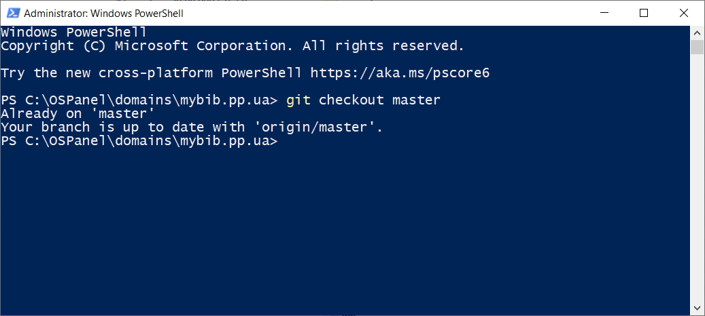
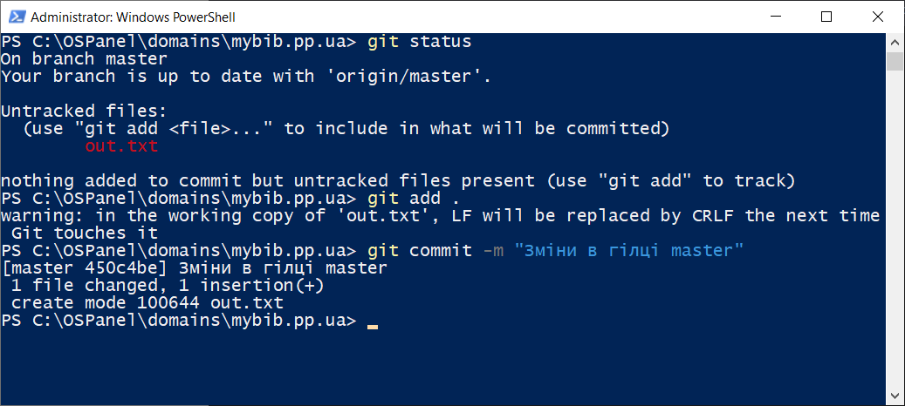
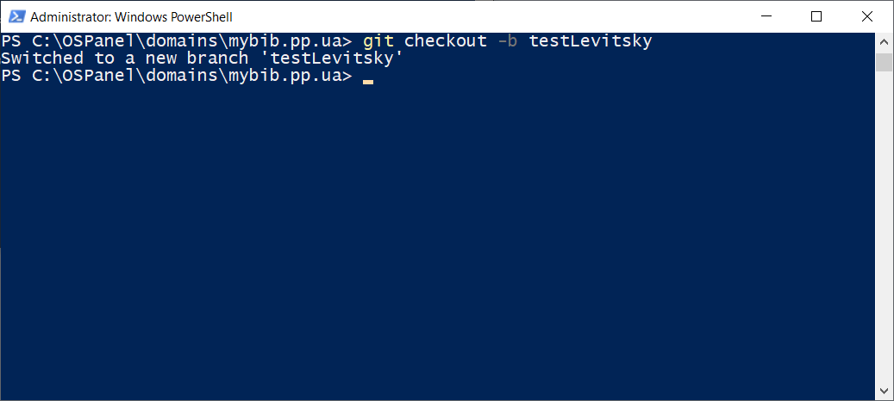
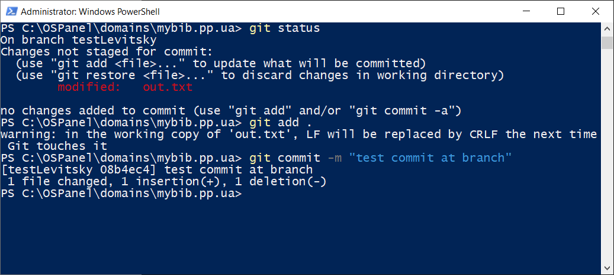
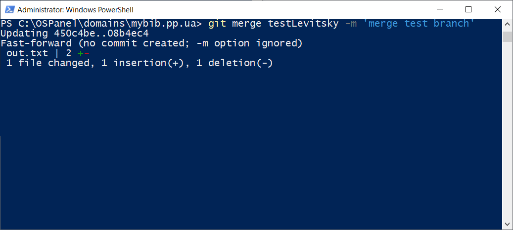
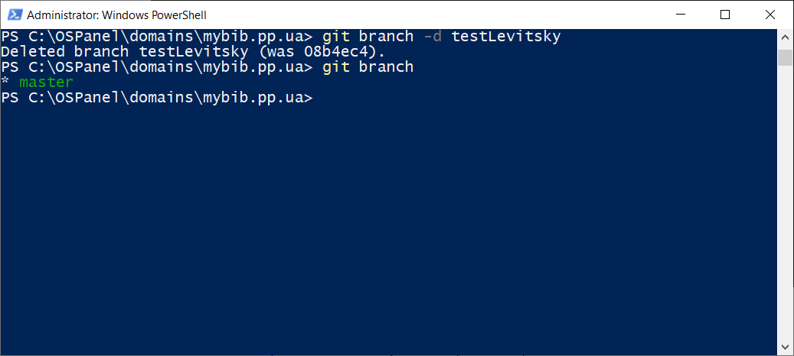

# Лабораторна робота №12. Зміни у гілці master. Злиття гілок

[Перелік усіх робіт](README.md)

## Мета роботи

Отримати навички скасування змін в локальній робочій копії у СКВ Git

## Теоретичні відомості

Під час роботи над складним проєктом можуть бути наступні ситуації:

1. В рамках одного проєкту необхідно створити альтернативний напрям розробки
2. В рамках проєкту необхідно паралельно вирішувати будь-яку невелику задачу, при цьому робота над задачею не має зачіпати основного коду до свого повного вирішення

### Порядок роботи з гілками

1. Створення гілки та перехід з поточної гілки на створену
2. Внесення змін
3. Фіксація змін
4. Злиття гілки з гілкою "master"
5. Видалення "непотрібної" гілки

## Хід роботи

1. Перевірити глобальні налаштування Git for Windows
2. Переконатись, що виконані всі завдання лабораторної роботи №11
3. Завантажити копію репозиторію лабораторних робіт з дисципліни "Інструментальні засоби візуального програмування"
4. Зробити поточною гілку "master"
    
5. Внести та зафіксувати зміни до гілки "master"
    
6. На базі гілки "master" створити гілку "testВашіПІБлатиницею2"
    
7. Внести та зафіксувати зміни до гілки "testВашіПІБлатиницею2"
    
8. Зробити поточною гілку "master"
9. Виконати операцію злиття з гілкою "testВашіПІБлатиницею2"
    
10. Видалити з репозиторію гілку "testВашіПІБлатиницею2"
    
11. Зробити поточною гілку "testВашіПІБлатиницею"
12. Додати в репозиторій новий файл та зафіксувати зміни
13. Зробити поточною гілку "master"
14. Виконати операцію злиття з гілкою "testВашіПІБлатиницею"
15. Видалити з репозиторію гілку "testВашіПІБлатиницею"
16. Переконатися, що в репозиторії не залишилося інших гілок окрім "master"
17. Вивантажити зміни на віддалений репозиторій
18. Для кожного етапу роботи зробити знімки екрану та додати їх у звіт з описом кожного скіншота
19. Дати відповіді на контрольні запитання
20. Зберегти звіт у форматі PDF
21. Завантажити збережений PDF у репозиторій для лабораторних робіт

## Контрольні питання

1. Як створити нову гілку в репозиторії за допомогою команди Git?
2. Як переконатися, що ви перебуваєте в поточній гілці перед створенням нової гілки?
3. Як внести зміни в створену гілку та зафіксувати їх в коміті?
4. Як переключитися між різними гілками в репозиторії за допомогою Git?
5. Як злити зміни з однієї гілки в іншу гілку за допомогою операції злиття (merge)?
6. Як переконатися, що конфлікти злиття не виникають перед виконанням операції злиття?
7. Як видалити гілку, яка більше не потрібна в репозиторії?
8. Як переконатися, що в репозиторії залишився тільки необхідний набір гілок, а інші були видалені?

## Довідники та додаткові матеріали

1. [Галуження в git - Управління гілками](https://git-scm.com/book/uk/v2/Галуження-в-git-Управління-гілками)
2. [Розгалуження в Git - Основи розгалуження і злиття](https://git-scm.com/book/ru/v2/Ветвление-в-Git-Основы-ветвления-и-слияния)
3. [Про розгалуження в Git](https://ru.hexlet.io/courses/git_base/lessons/introduction_to_git_branches_theory/theory_unit)
4. [Видалення гілок в Git (локальних та віддалених)](https://badcode.ru/kak-udalit-vietku-v-git-lokalnuiu-ili-udalionnuiu/)
5. [Злиття гілок в Git](https://deadsith.GitHub.io/2017/01/11/%D0%B7%D0%BB%D0%B8%D1%82%D1%82%D1%8F-%D0%B2%D1%96%D1%82%D0%BE%D0%BA-%D0%B2-git/)
