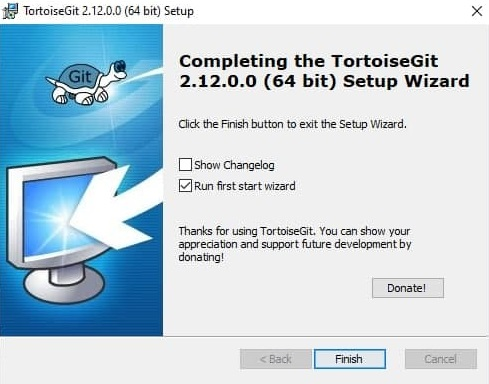
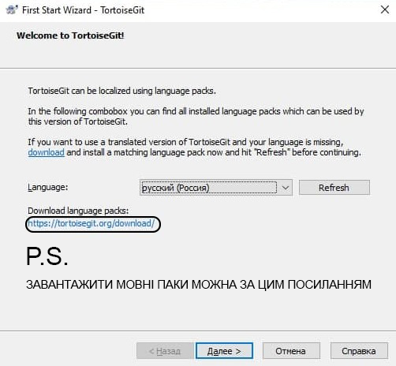
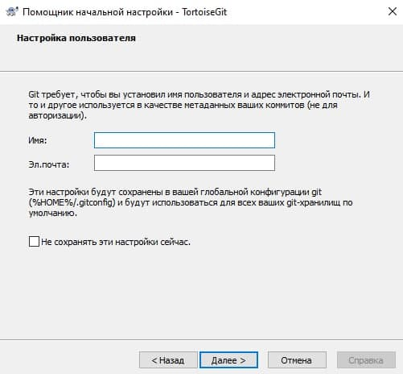
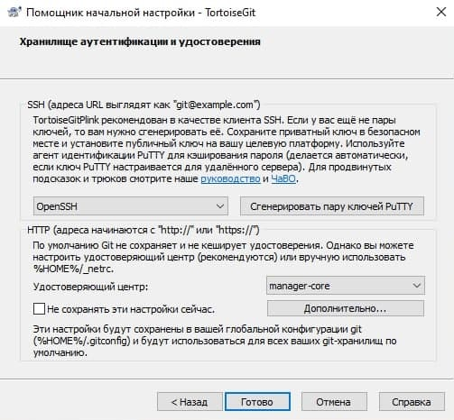
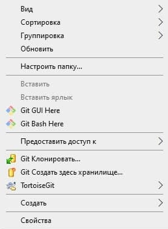

# Лабораторна робота №14. Робота з графічним клієнтом TortoiseGit

[Перелік усіх робіт](README.md)

## Мета роботи

Отримати навички роботи у графічній оболонці TortoiseGit

## Теоретичні відомості

## Хід роботи

1.  Перевірити глобальні налаштування Git for Windows
2.  Завантажити та встановити на комп'ютер графічну оболонку TortoiseGit. В разі необхідності перезавантажити комп'ютер
    
    
    
    
3.  Перевірити наявність в контекстному меню Windows пунктів TortoiseGit

    

4.  За допомогою графічного інтерфейсу виконати наступні дії
    1.  Клонувати віддалений репозиторій
    2.  Внести зміни в репозиторій та зафіксувати їх.
    3.  Створити гілку репозиторію "testВашіПІБлатиницею3"
    4.  Внести зміни та зафаксувати їх
    5.  Перемкнутися на гілку "master"
    6.  Виконати злиття всіх існуючих гілок з гілкою "master"
    7.  Видалити усі гілки, окрім "master"
    8.  Вивантажити зміни на віддалений репозиторій
    9.  Змінити віддалений репозиторій
    10. Вивантажити зміни на віддалений репозиторій
5.  Для кожного етапу роботи зробити знімки екрану та додати їх у звіт з описом кожного скіншота
6.  Дати відповіді на контрольні запитання
7.  Зберегти звіт у форматі PDF
8.  Завантажити збережений PDF у репозиторій для лабораторних робіт

## Контрольні питання

1.  Що таке TortoiseGit?
2.  Для чого використовують TortoiseGit?
3.  Які вам відомі аналоги TortoiseGit?
4.  Чи можливо використати графічний інтерфейс TortoiseGit для злиття гілок?
5.  TortoiseGit: в чому різниця між "Git Sync", "Fetch" і "Pull"?

## Довідники та додаткові матеріали

1.  [TortoiseGit](https://tortoisegit.org/)
2.  [TortoiseGit Manual](https://tortoisegit.org/docs/tortoisegit/)
3.  [Інструменти для роботи з Git - TortoiseGit](http://pr0git.blogspot.com/2015/03/git-tortoisegit.html)
4.  [Як завантажити TortioiseGit в Windows](https://tortoisegit.org/docs/tortoisegit/tgit-intro-install.html)
5.  [Переваги та недоліки TortoiseGit](https://coderoad.ru/6011893/)
