# Лабораторна робота №15. Робота з GitHub CLI

[Перелік усіх робіт](README.md)

## Мета роботи

Ознайомитися з інструментом командного рядка GitHub CLI (gh), навчитися виконувати базові операції з GitHub-репозиторіями, працювати з Issues, Pull Requests та автентифікуватися у GitHub через CLI.

---

## Теоретичні відомості

### 1. GitHub CLI

GitHub CLI (gh) — це офіційний інструмент командного рядка, який дозволяє взаємодіяти з GitHub без переходу у браузер.  
Завдяки `gh` можна:

- створювати та керувати репозиторіями;
- працювати з issues та pull requests;
- переглядати інформацію про користувача;
- виконувати GitHub-операції з терміналу.

### 2. Встановлення GitHub CLI

На більшості систем встановлення виконується через пакетний менеджер.

macOS (Homebrew):

```bash
brew install gh
```

Ubuntu:

```bash
sudo apt install gh
```

Windows (winget):

```powerbash
winget install GitHub.cli
```

Перевірка встановлення:

```bash
gh --version
```

### 3. Авторизація в GitHub CLI

Для автентифікації використовують команду:

```bash
gh auth login
```

Під час входу обирається платформа GitHub.com, метод (HTTPS або SSH) та спосіб підтвердження особи.

### 4. Основні команди GitHub CLI

#### 4.1. Створення репозиторію

```bash
gh repo create my-project --public
```

#### 4.2. Клонування репозиторію

```bash
gh repo clone owner/repo
```

#### 4.3. Перегляд інформації

```bash
gh repo view
gh repo view --web
```

#### 4.4. Робота з Issues

Створення:

```bash
gh issue create --title "Bug" --body "Description..."
```

Перегляд списку:

```bash
gh issue list
gh issue view 1
```

#### 4.5. Робота з Pull Requests

Створення:

```bash
gh pr create --title "Feature" --body "Description..."
```

Перегляд:

```bash
gh pr list
gh pr view --web
```

---

## Хід роботи

### 1. Встановити GitHub CLI

Виконати:

```bash
gh --version
```

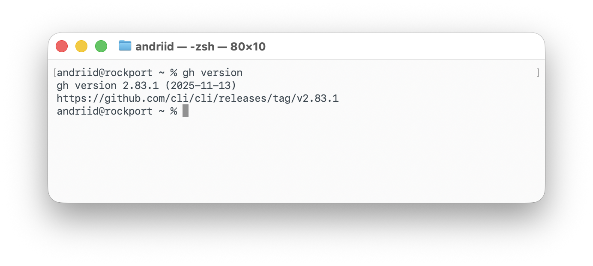

---

### 2. Пройти автентифікацію

```bash
gh auth login
```

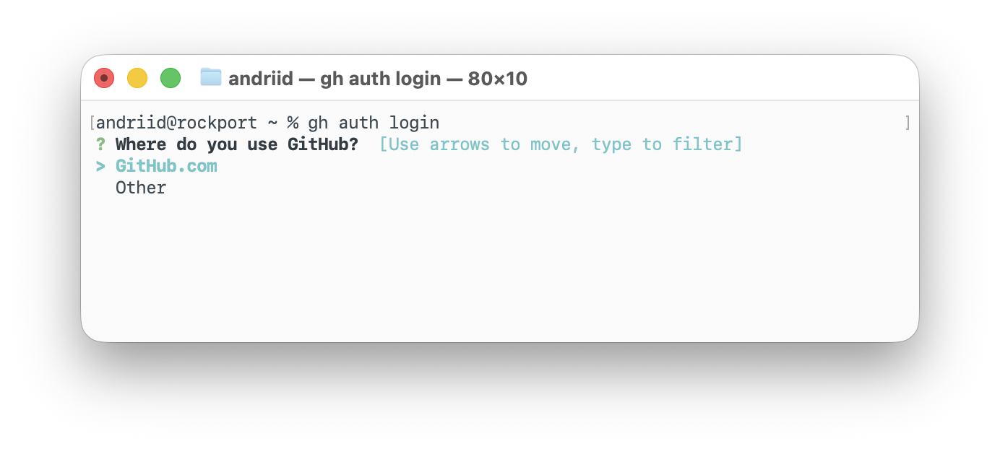

---

### 3. Створити новий репозиторій через GitHub CLI

```bash
gh repo create lab15-gh-cli --public --clone
```

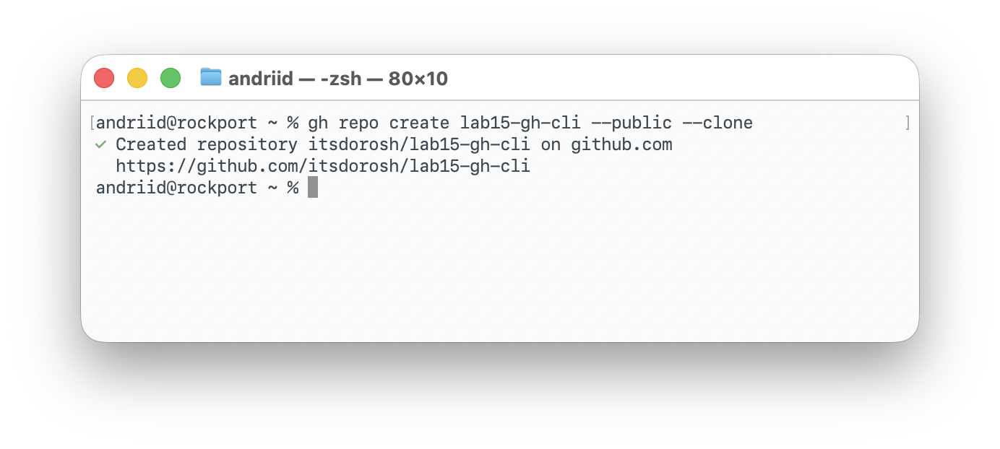  


---

### 4. Додати README.md та виконати коміт

```bash
echo "# Лабораторна робота 15" > README.md
git add README.md
git commit -m "Add README"
git push
```

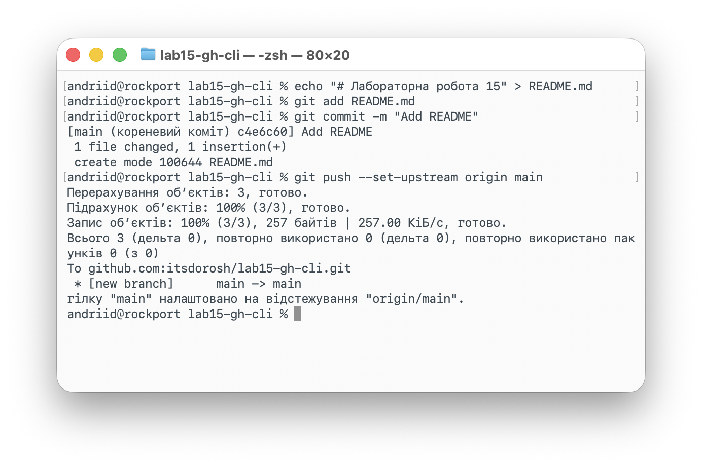

---

### 5. Створити Issue

```bash
gh issue create --title "Додати опис про GitHub CLI" --body "Необхідно розширити README.md"
```

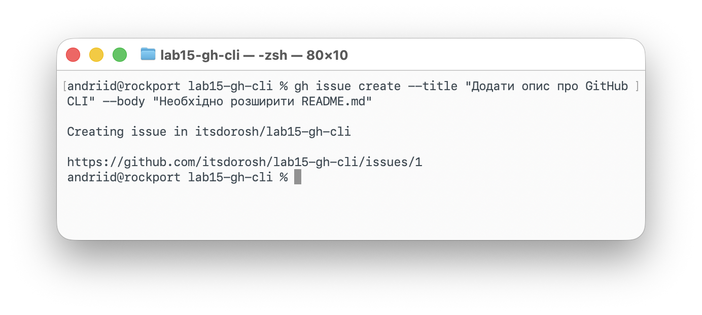  
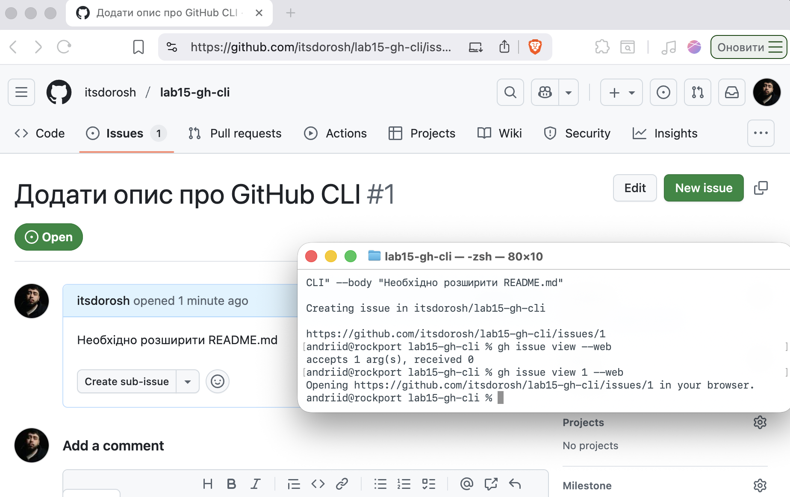

---

### 6. Створити нову гілку та оновити README.md

```bash
git checkout -b feature/readme-update
```

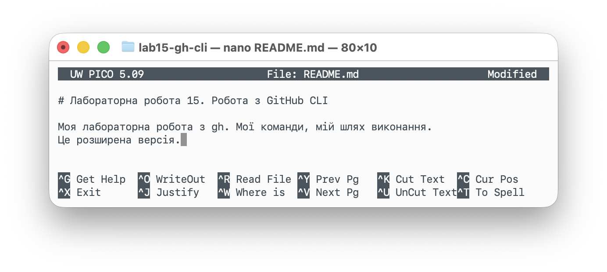

Після редагування:

```bash
git add README.md
git commit -m "Update README with GitHub CLI section"
git push --set-upstream origin feature/readme-update
```

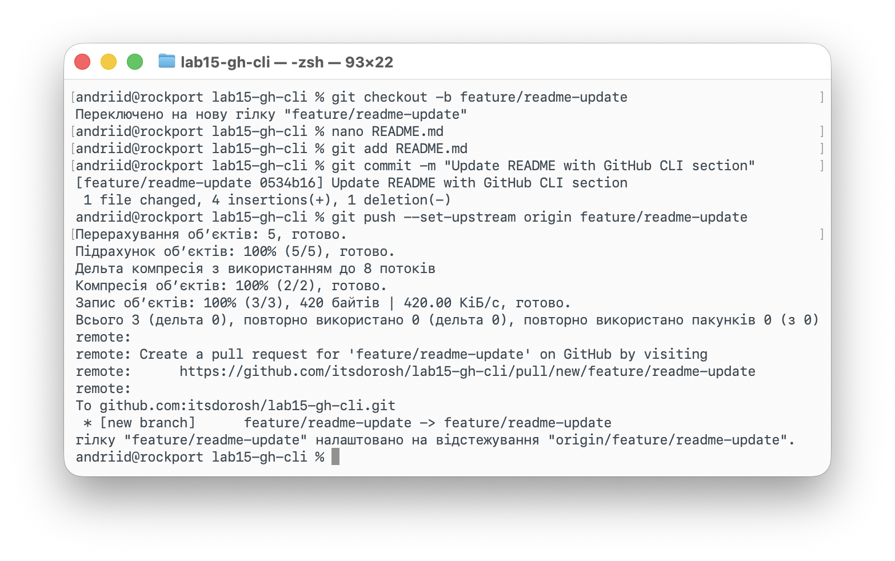

---

### 7. Створити Pull Request

```bash
gh pr create --title "Оновлення README" --body "Додано розділ про GitHub CLI"
```

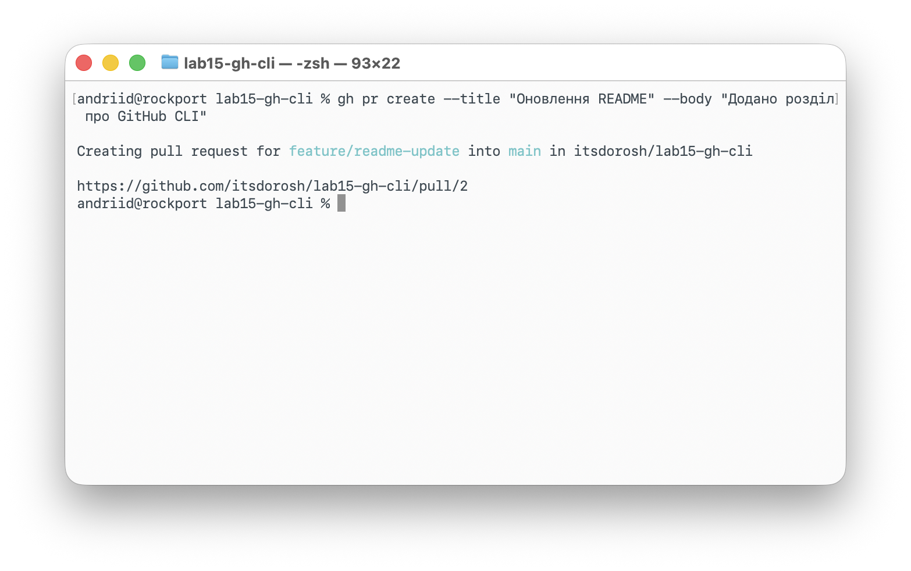  
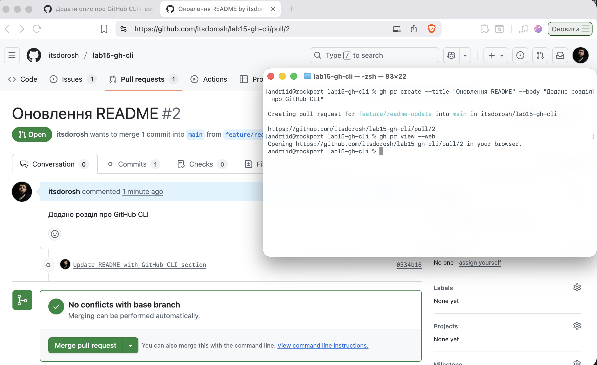

---

### 8. Переглянути список Pull Requests

```bash
gh pr list
```

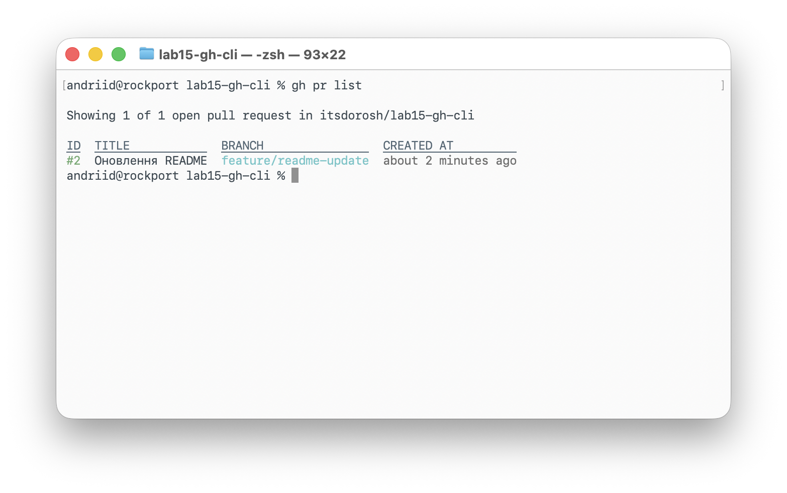

---

### 9. Виконати злиття (merge)

```bash
gh pr merge
```

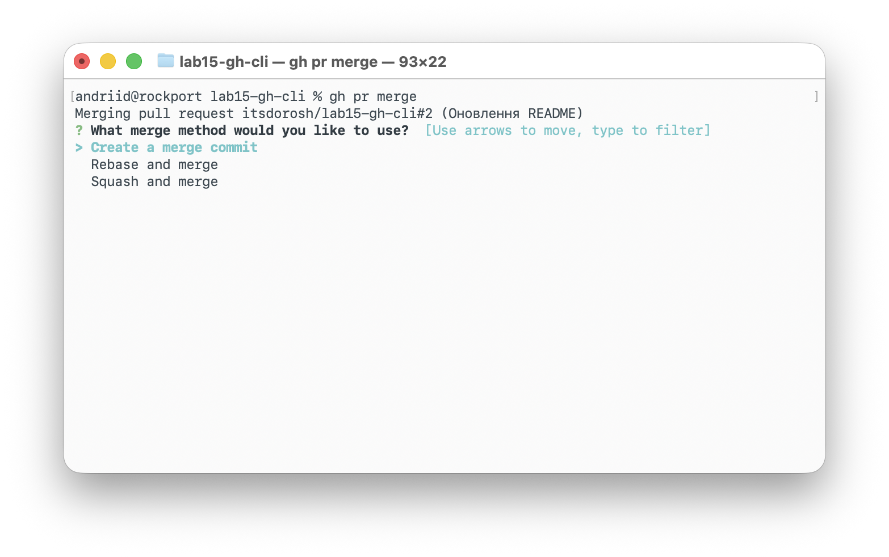
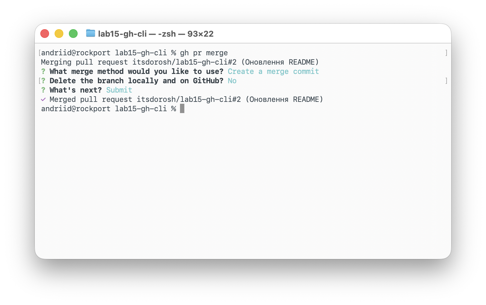

---

### 10. Видалити гілку після мерджу

```bash
git checkout main
git pull
git branch -d feature/readme-update
```

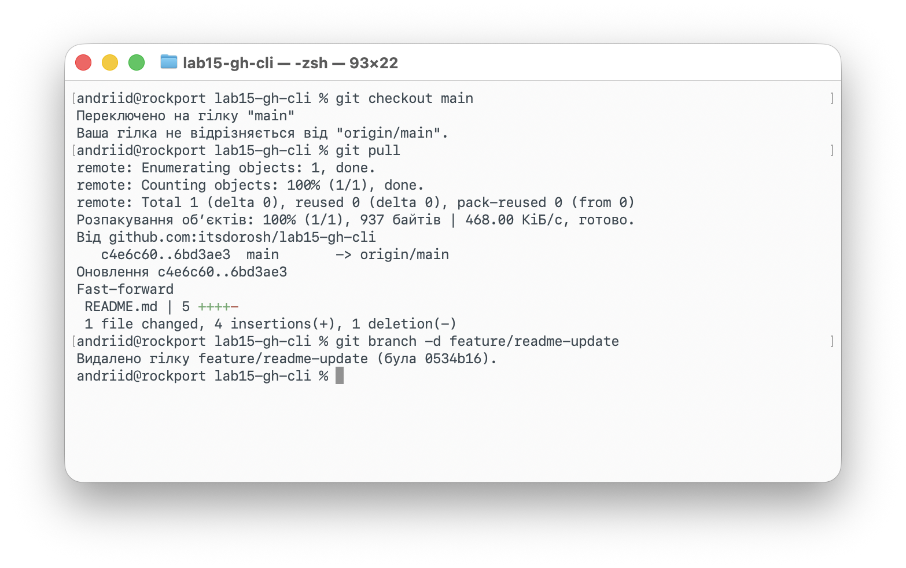

---

## Завдання

1. Встановити GitHub CLI та пройти авторизацію.
2. Створити новий репозиторій через GitHub CLI.
3. Додати файл README.md та виконати коміт.
4. Створити Issue.
5. Створити гілку та оновити README.md.
6. Створити Pull Request.
7. Виконати злиття PR.
8. Видалити гілку після мерджу.
9. Додати всі скріншоти у звіт згідно з інструкцією.

## Контрольні питання

1. Що таке GitHub CLI і для чого його використовують?
2. Які переваги GitHub CLI у порівнянні з роботою через вебінтерфейс GitHub?
3. Як виконати автентифікацію в GitHub CLI?
4. Які основні команди GitHub CLI для роботи з репозиторіями?
5. Як за допомогою GitHub CLI створити Issue або Pull Request?
6. Чи можна переглядати інформацію про репозиторій у браузері через GitHub CLI?
7. Які дії GitHub CLI автоматизує у повсякденній роботі з GitHub?

## Довідники та додаткові матеріали

1. [GitHub CLI (офіційний сайт)](https://cli.github.com)
2. [Документація GitHub CLI](https://cli.github.com/manual/)
3. [GitHub CLI на GitHub — вихідний код](https://github.com/cli/cli)
4. [Як встановити та використовувати GitHub CLI? (відео)](https://youtube.com/watch?v=vcAIZ4axYZU)
5. [Стаття: Основи роботи з GitHub CLI](https://docs.github.com/en/github-cli/github-cli/about-github-cli)
