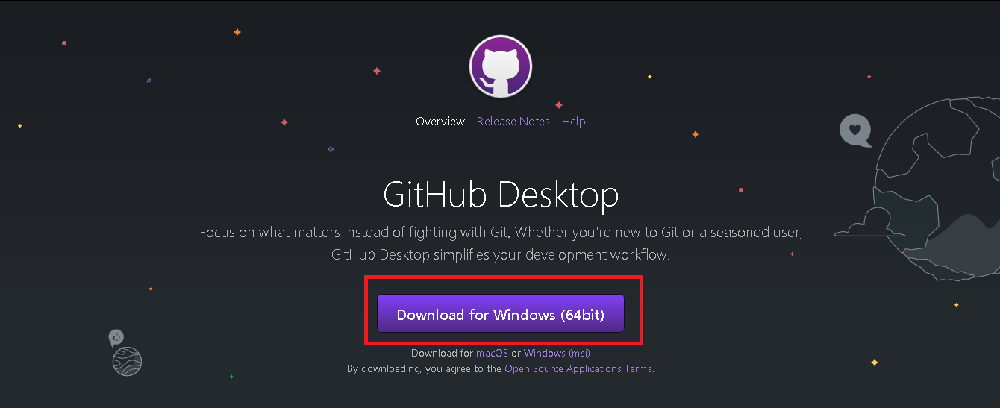
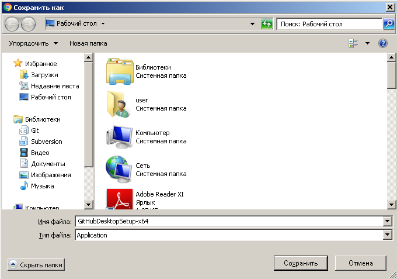
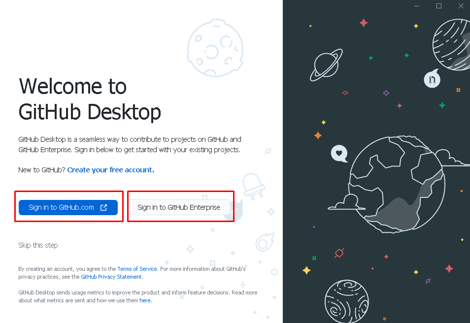
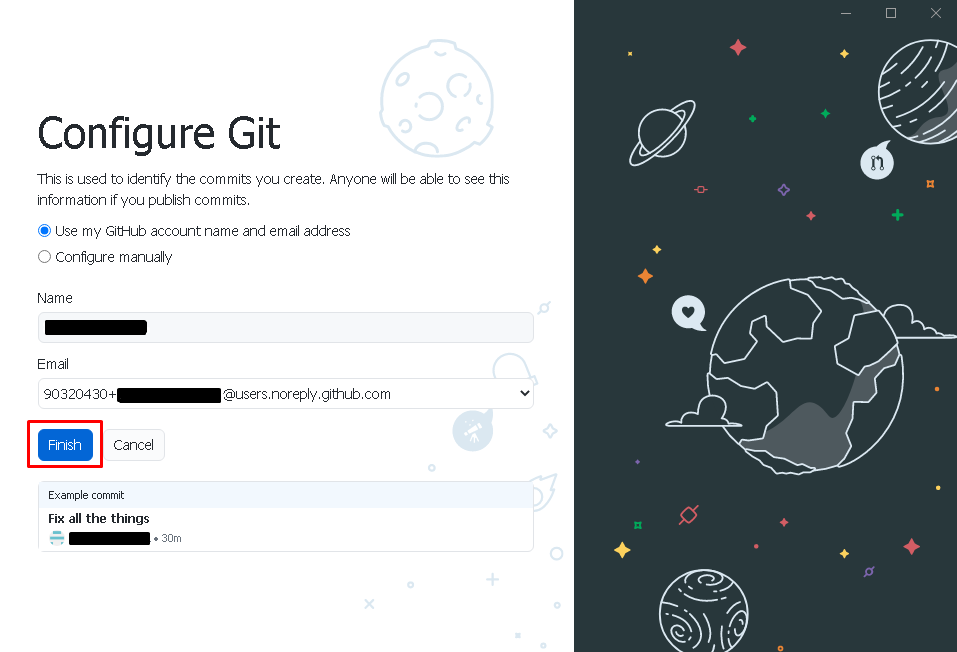

# Лабораторна робота №15. Робота з графічним клієнтом Github

[Перелік усіх робіт](README.md)

## Мета роботи

Отримати навички роботи у графічній оболонці Github

## Теоретичні відомості

Для встановлення на комп'ютер `GitHub Desktop` необідно виконати наступні дії:

1. Перейти на сайт https://desktop.github.com/;
2. Натиснути на кнопку **Download for Windows**:

   

3. Зберегти файл у потрібну папку:

   

4. Після завантаження файлу відкрити його та обрати спосіб авторизації:

   

5. Завершити інсталювання:

   

6. Програма готова до використання.

## Хід роботи

1.  Перевірити глобальні налаштування Git for Windows
2.  Завантажити та встановити на комп'ютер графічну оболонку Github. В разі необхідності перезавантажити комп'ютер
3.  Перевірити наявність в контекстному меню Windows пунктів Github
4.  За допомогою графічного інтерфейсу виконати наступні дії
    1.  Клонувати віддалений репозиторій
    2.  Внести зміни в репозиторій та зафіксувати їх.
    3.  Створити гілку репозиторію "testВашіПІБлатиницею3"
    4.  Внести зміни та зафаксувати їх
    5.  Перемкнутися на гілку "master"
    6.  Виконати злиття всіх існуючих гілок з гілкою "master"
    7.  Видалити усі гілки, окрім "master"
    8.  Вивантажити зміни на віддалений репозиторій
    9.  Змінити віддалений репозиторій
    10. Вивантажити зміни на віддалений репозиторій
5.  Для кожного етапу роботи зробити знімки екрану та додати їх у звіт з описом кожного скіншота
6.  Дати відповіді на контрольні запитання
7.  Зберегти звіт у форматі PDF
8.  Завантажити збережений PDF у репозиторій для лабораторних робіт

## Контрольні питання

1.  Що таке Github?
2.  Для чого використовують Github?
3.  Які вам відомі аналоги Github?
4.  Чи можливо використати графічний інтерфейс Github для злиття гілок?

## Довідники та додаткові матеріали

1. [Github Desktop (завантажити)](https://desktop.github.com)
2. [Github Desktop документація](https://docs.github.com/en/desktop)
3. [Як почати працювати з Github Desktop](https://htmlacademy.ru/blog/boost/tools/github-desktop)
4. [Як встановити та як використовувати GitHub Desktop? (відео)](https://www.youtube.com/watch?v=9oE3RhQRUbE)
5. [Відмінності Github Desktop від Git](https://coderoad.ru/61435843/)
6. [Переваги Github Desktop](https://habr.com/ru/post/520854/)
