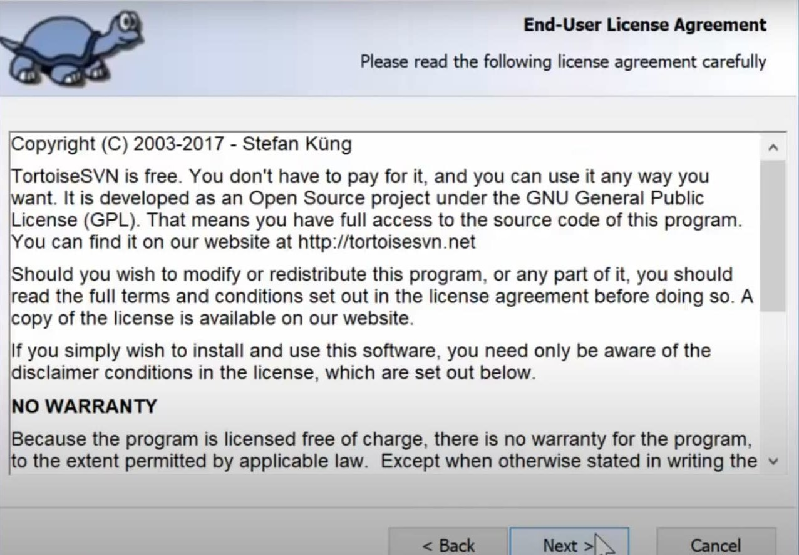

# ЛР 16. Встановлення та налаштування клієнту СКВ Subversion

## Перелік

1. [Реєстрація на Github та створення репозиторію](lab-01.md)
2. [Встановлення та налаштування клієнту СКВ Git](lab-02.md)
3. [Клонування репозиторію засобами Git for Windows](lab-03.md)
4. [Додавання файлв у репозиторій на Github ](lab-04.md)
5. [Внесення змін до репозиторію](lab-05.md)
6. [Створення репозиторію для власних лабораторних робіт](lab-06.md)
7. [Командна робота над проектом на Github ](lab-07.md)
8. [Створення та видалення тегів](lab-08.md)
9. [Робота з історією змін та отримання старих версій](lab-09.md)
10. [Відміна індексованих змін та фіксацій](lab-10.md)
11. [Створення гілок та навігація у розгалуженному проекті](lab-11.md)
12. [Зміни у гілці master. Злиття гілок](lab-12.md)
13. [Штучне створення конфлікту та його вирішення](lab-13.md)
14. [Робота з графічним клієнтом TortoiseGit](lab-14.md)
15. [Робота з графічним клієнтом Github](lab-15.md)
16. [Встановлення та налаштування клієнту СКВ Subversion](lab-16.md)
17. [Робота з репозиторієм в консольному режимі TortoiseSVN](lab-17.md)
18. [Робота з версіями в TortoiseSVN](lab-18.md)
19. [Робота з репозиторієм в IDE Netbeans](lab-19.md)
20. [Створення репозиторію для дипломного проекту](lab-20.md)

## Мета роботи

Отримати навички роботи у графічній оболонці клієнту TortoiseSVN

## Теоретичні відомості

`svn checkout` в контекстному меню

`svn checkout` вікно нашалтування

`svn checkout` вікно результату

`svn commit` в контекстному меню

`svn commit` вікно нашалтування

`svn commit` вікно результату

Контестне меню

Check for modification

Merge

Shelve

Get lock

Update to revision

## Хід роботи

1.  Перейти на сайт завантаження `TortoiseSVN`: https://tortoisesvn.net/downloads.html
2.  Завантажити та встановити на комп'ютер графічну оболонку TortoiseSVN. В разі необхідності перезавантажити комп'ютер.
    Для цього необхідно: 1. Обрати розрядність системи, та натиcнути на завантаження правильного завантажувача.

           

        2. Запустити завантажувач `TortoiseSVN`.

           

        3. Обрати кнопку *Next*.

           

        4. Обрати місце завантаження програми кнопкою *Browse*.

           

        5. Обрати пункт *Will be installed on local hard drive* та натиснути *Next*.

           

        6. Завантажити програму.

           

        7. Натиснути кнопку *Finish*.

           

3.  Перевірити наявність в контекстному меню Windows пунктів TortoiseSVN
4.  За допомогою графічного інтерфейсу виконати наступні дії

    1.  Клонувати віддалений репозиторій
    2.  Внести зміни в репозиторій та зафіксувати їх.
    3.  Створити гілку репозиторію "testВашіПІБлатиницею3"
    4.  Внести зміни та зафаксувати їх
    5.  Перемкнутися на гілку "master"
    6.  Виконати злиття всіх існуючих гілок з гілкою "master"
    7.  Видалити усі гілки, окрім "master"
    8.  Вивантажити зміни на віддалений репозиторій
    9.  Змінити віддалений репозиторій
    10. Вивантажити зміни на віддалений репозиторій

5.  Для кожного етапу роботи зробити знімки екрану та додати їх у звіт з описом кожного скіншота
6.  Дати відповіді на контрольні запитання
7.  Зберегти звіт у форматі PDF
8.  Завантажити збережений PDF у репозиторій для лабораторних робіт

## Контрольні питання

1.  Що таке TortoiseSVN?
2.  Перелічіть можливості TortoiseSVN
3.  Як можливо витягти робочу копію в TortoiseSVN?
4.  Як створити сховище за допомогою TortoiseSVN?
5.  Як експортувати робочу копію Subversion в TortoiseSVN?

## Довідники та додаткові матеріали

1.  [TortoiseSVN](https://tortoisesvn.net/)
2.  [TortoiseSVN FAQ](https://tortoisesvn.net/faq.html)
3.  [Сторінка завантаження TortoiseSVN](https://tortoisesvn.net/downloads.html)
4.  [Сховище в TortoiseSVN](https://tortoisesvn.net/docs/nightly/TortoiseSVN_ru/tsvn-repository.html)
5.  [Можливості TortoiseSVN](https://tortoisesvn.net/docs/release/TortoiseSVN_ru/tsvn-preface-features.html)
