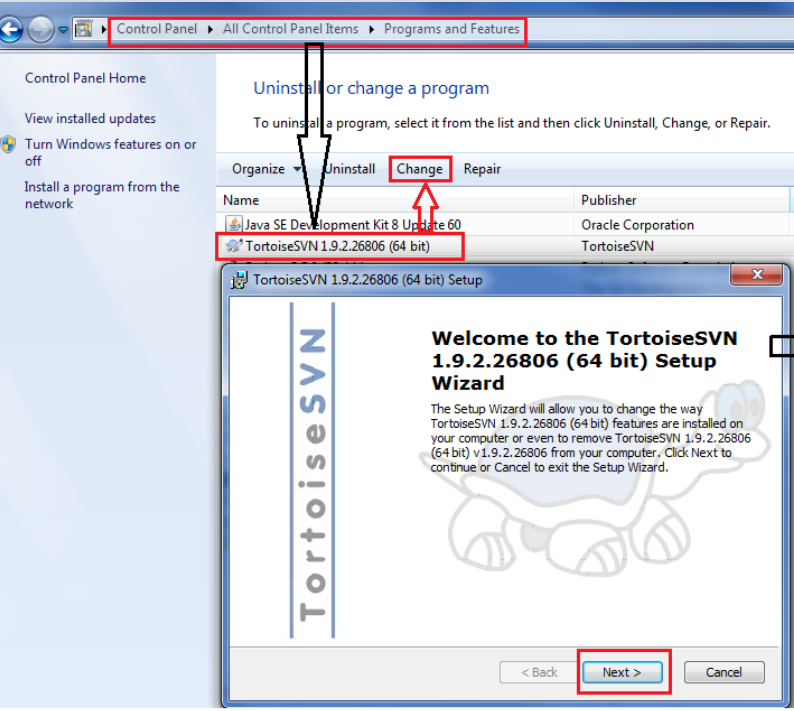
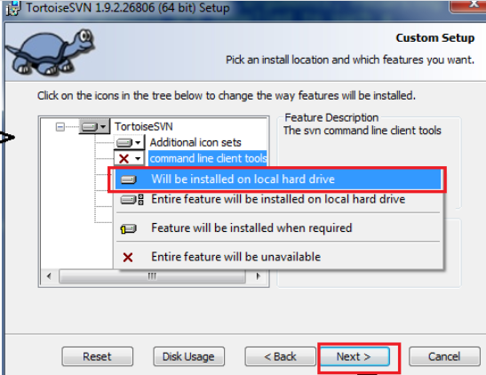

# ЛР 17. Робота з репозиторієм в консольному режимі TortoiseSVN

## Перелік

1. [Реєстрація на Github та створення репозиторію](lab-01.md)
2. [Встановлення та налаштування клієнту СКВ Git](lab-02.md)
3. [Клонування репозиторію засобами Git for Windows](lab-03.md)
4. [Додавання файлв у репозиторій на Github ](lab-04.md)
5. [Внесення змін до репозиторію](lab-05.md)
6. [Створення репозиторію для власних лабораторних робіт](lab-06.md)
7. [Командна робота над проектом на Github ](lab-07.md)
8. [Створення та видалення тегів](lab-08.md)
9. [Робота з історією змін та отримання старих версій](lab-09.md)
10. [Відміна індексованих змін та фіксацій](lab-10.md)
11. [Створення гілок та навігація у розгалуженному проекті](lab-11.md)
12. [Зміни у гілці master. Злиття гілок](lab-12.md)
13. [Штучне створення конфлікту та його вирішення](lab-13.md)
14. [Робота з графічним клієнтом TortoiseGit](lab-14.md)
15. [Робота з графічним клієнтом Github](lab-15.md)
16. [Встановлення та налаштування клієнту СКВ Subversion](lab-16.md)
17. [Робота з репозиторієм в консольному режимі TortoiseSVN](lab-17.md)
18. [Робота з версіями в TortoiseSVN](lab-18.md)
19. [Робота з репозиторієм в IDE Netbeans](lab-19.md)
20. [Створення репозиторію для дипломного проекту](lab-20.md)

## Мета роботи

Отримати навички роботи у консолы клієнту svn

## Теоретичні відомості

### Встановлення консольного клієнта

Для коректної роботи консольного клієнту `svn` він має бути встановленим у системі. Для ОС Windows можливо використовувати консольний інтерфейс, який може бути встановленим з пакету `TortoiseSVN`

Для встановлення консольного фнтерфейсу `TortoiseSVN` необідно виконати наступні дії:

1.  

    В налаштуваннях комп'ютера додаємо підключення з СКВ Subversion за замовчуванням.Та починаємо встановлювати додаток.

2.  

    Відкриваємо меню Модифікації.

3.  

    Вмикаємо встановлення командного рядка на жорсткий диск

4.  

    Погоджуємося з усіма змінами.

5.  

    Программа готова до використання

### Команди TortoiseSVN:

1.  Клонувати (оновити): `svn checkout [-depth ARG] [--ignore-externals] [-r rev] URL ШЛЯХ`

```bash
$ svn checkout https://github.com/solidol/NMKD_IZVP/
A    NMKD_IZVP\branches
A    NMKD_IZVP\branches\BogdanGaybura-patch-1
A    NMKD_IZVP\branches\BogdanGaybura-patch-1\README.md
A    NMKD_IZVP\branches\BogdanGaybura-patch-1\Дидактичні
A    NMKD_IZVP\branches\BogdanGaybura-patch-1\Дидактичні\list.txt
...
A    NMKD_IZVP\trunk\Самостійні\list.txt
Checked out revision 54.
```

2.  Статус (інформація): `svn info URL_рабочої_копії; svn update [-r rev] ШЛЯХ`

```bash
$ svn info
Path: .
Working Copy Root Path: E:\NMKD\NMKD_IZVP
URL: https://github.com/solidol/NMKD_IZVP
Relative URL: ^/
Repository Root: https://github.com/solidol/NMKD_IZVP
Repository UUID: 029f97c0-4227-030f-9c6a-ce57b7db7bff
Revision: 54
Node Kind: directory
Schedule: normal
Last Changed Author: solidol
Last Changed Rev: 54
Last Changed Date: 2020-11-26 15:16:10 +0200 (×ò, 26 Ëèñ 2020)
```

3.  Відгалуження / Мітка: `svn copy -m "Повідомлення Журналу" URL URL`
4.  Видалити: `svn delete ШЛЯХ`
5.  Перейменувати: `svn rename ПОТОЧНИЙ_ШЛЯХ НОВИЙ_ШЛЯХ`
6.  Злиття: `svn merge [--dry-run] --force От_URL@revN До_URL@revM ШЛЯХ`
7.  Створити латку: `svn diff ШЛЯХ > файл-латка`
8.  Перевірка на наявність змін: `svn status -v ШЛЯХ`

## Хід роботи

1.  Перейти на сайт завантаження TortoiseSVN
2.  Завантажити та встановити на комп'ютер клієнт TortoiseSVN. В налаштуваннях інсталятора додати встановлення консольного інтерфейсу, за прикладом у теоретичних відомостях. В разі необхідності перезавантажити комп'ютер
3.  Перевірити роботу консольного інтерфейсу за допомогою консолі Windows, виконавши команду `svn -h`
4.  За допомогою консольного інтерфейсу виконати наступні дії

    1.  Клонувати віддалений репозиторій
    2.  Внести зміни в репозиторій та зафіксувати їх.
    3.  Створити гілку репозиторію "testВашіПІБлатиницею3"
    4.  Внести зміни та зафаксувати їх
    5.  Перемкнутися на гілку "master"
    6.  Виконати злиття всіх існуючих гілок з гілкою "master"
    7.  Видалити усі гілки, окрім "master"
    8.  Вивантажити зміни на віддалений репозиторій
    9.  Змінити віддалений репозиторій
    10. Вивантажити зміни на віддалений репозиторій

5.  Для кожного етапу роботи зробити знімки екрану або скопіювати текст консолі та додати їх у звіт з описом кожного скіншота
6.  Дати відповіді на контрольні запитання
7.  Зберегти звіт у форматі PDF
8.  Завантажити збережений PDF у репозиторій для лабораторних робіт

## Контрольні питання

1.  Чи використовує діалог фіксації TortoiseSVN кілька команд Subversion?
2.  Яку команду потрібно використати для порівняння зміненого файлу з його базовою ревізією?
3.  Яку кількість повідомлень журналу TortoiseSVN за замовчуванням намагається витягти використовуючи метод --limit?
4.  В якому форматі TortoiseSVN створює файл заплатки?
5.  Чи має команда "Pедагувати конфлікти" еквівалент в svn?

## Довідники та додаткові матеріали

1.  [TortoiseSVN](https://tortoisesvn.net/)
2.  [TortoiseSVN FAQ](https://tortoisesvn.net/faq.html)
3.  [Сторінка завантаження TortoiseSVN](https://tortoisesvn.net/downloads.html)
4.  [Робота з гілками в TortoiseSVN](https://habr.com/ru/post/45203/)
5.  [Основні поняття TortoiseSVN](https://betacode.net/10261/install-and-use-tortoise-svn)
