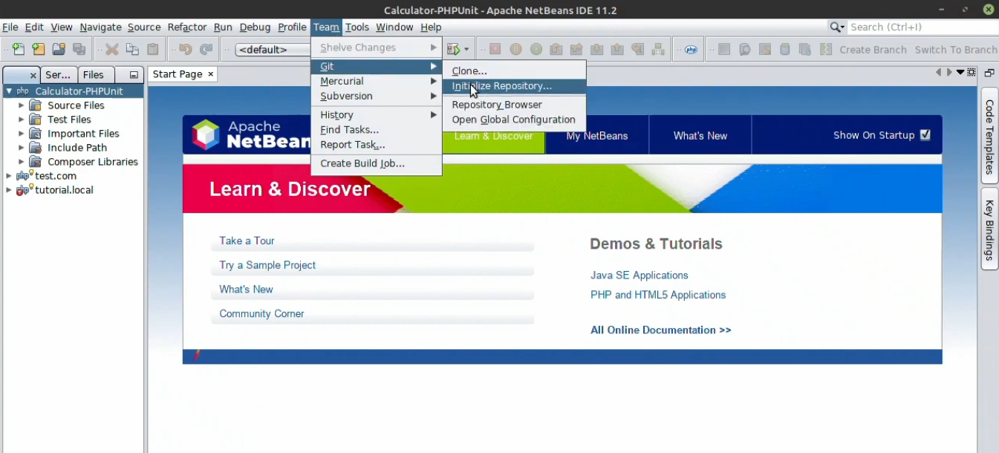
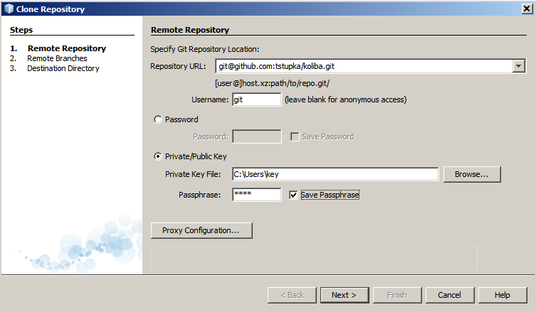
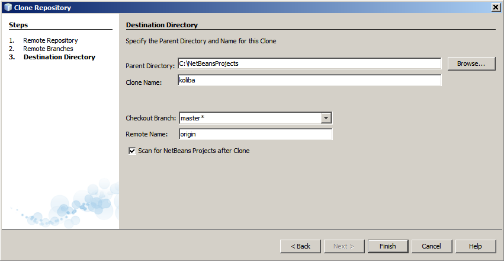
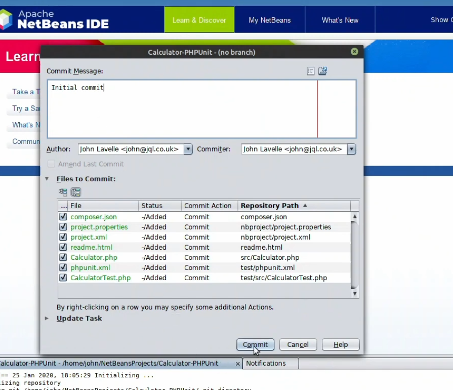
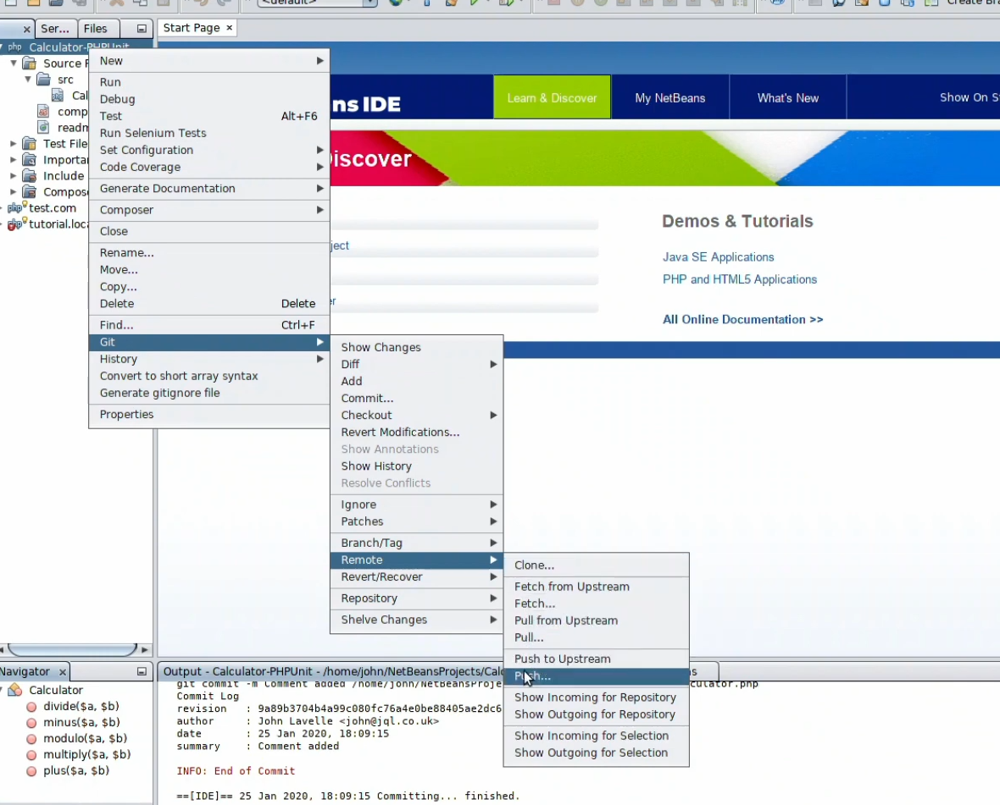
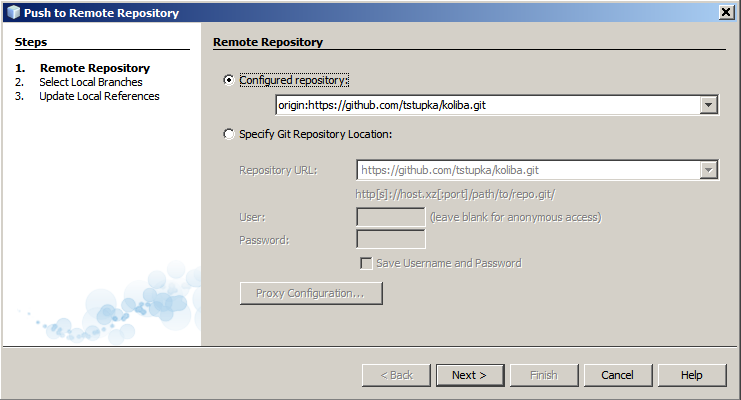

# Лабораторна робота №19. Робота з Git репозиторієм через Apache NetBeans

[Перелік усіх робіт](README.md)

## Мета роботи

Отримати навички роботи з репозиторієм через Apache NetBeans

## Теоретичні відомості

### Ініціалізація репозиторію

Якщо у вас ще немає Git репозиторія, ви можете його проініціалізувати наступним чином:

1. Відкрити потрібну папку;
2. Натиснути меню середовища Apache NetBeans на пункт "Team";
3. Навести на пункт Git;
4. Обрати пункт "Initialize Repository";
5. Підтвердити шлях до репозиторію

   

### Клонування віддаленого репозиторію

Якщо віддалений Git репозиторій **вже наявний** на GitHub, то його можна склонувати за таким чином:

1. У провіднику Apache NetBeans на папці репозиторію натиснути правою кнопкою миші;
2. Перейти на пункт меню "Git";
3. Натиснути на пункт "Clone";
4. Для клонування через **HTTPS**: ввести ім'я свого користувача і пароль. Для клонування через **SSH:** обрати файл з SSH ключем;

   

5. Далі оберіть шлях до каталогу на жорсткому диску, в який потрібно зберегти репозиторій.
6. Введіть ім'я клона: ім'я локальної папки, в якій потрібно створити клон віхідного проекту;
7. Оберіть гілку,яку потрібно вилучити в робоче дерево;
8. Установіть прапорець "Scan for Netbeans projects after Clone";

   

9. Натисніть кнопку "Finish";

### Коміт (commit) змін в репозиторії

Для виконання коміту змін в репозиторії потрібно зробити наступне:

1. Натиснути меню середовища Apache NetBeans на пункт "Team";
2. Навести на пункт Git;
3. Обрати пункт "Commit";

   Відкриється діалогове вікно для виконання коміту. Далі потрібно ввести повідомлення для коміту, автора та обрати файли, які потрібно внести до коміту.

   

### Заливання (push) змін в репозиторії

Щоб перший раз (надалі потрібно буде тільки підтверджувати посилання на репозиторій) залити локальний репозиторій з комітом на GitHub потрібно:

1. Створити публічний репозиторій на GitHub;
2. Якщо не має SSH ключа - створити його;
3. У провіднику Apache NetBeans на папці репозиторію натиснути правою кнопкою миші;
4. Перейти на пункт меню "Git";
5. Далі перейти на пункт "Remote";
6. Обрати пункт "Push";

   

7. Після введення паролю ввести посилання на раніше створений репозиторій та ввести ім'я свого користувача і пароль на GitHub (для виконання заливання в репозиторій через протокол SSH потрібно обрати файл з SSH ключем);
8. Далі обрати гілку, на яку потрібно залити репозиторій.

   
