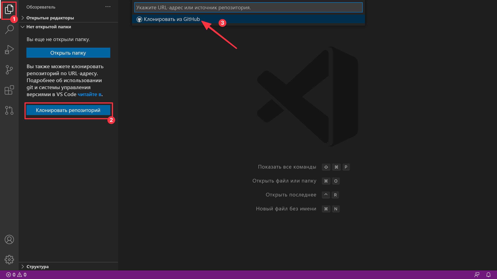
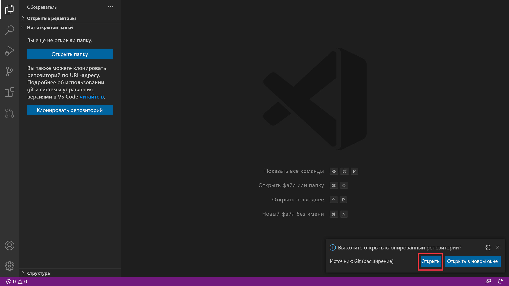
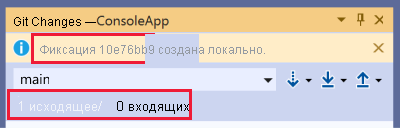
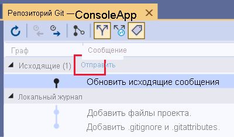
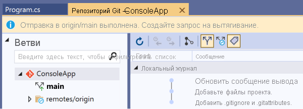

# ЛР 20. Робота з Git репозиторієм через Visual Studio Code

## Перелік

1. [Реєстрація на Github та створення репозиторію](lab-01.md)
2. [Встановлення та налаштування клієнту СКВ Git](lab-02.md)
3. [Клонування репозиторію засобами Git for Windows](lab-03.md)
4. [Додавання файлв у репозиторій на Github ](lab-04.md)
5. [Внесення змін до репозиторію](lab-05.md)
6. [Створення репозиторію для власних лабораторних робіт](lab-06.md)
7. [Командна робота над проектом на Github ](lab-07.md)
8. [Створення та видалення тегів](lab-08.md)
9. [Робота з історією змін та отримання старих версій](lab-09.md)
10. [Відміна індексованих змін та фіксацій](lab-10.md)
11. [Створення гілок та навігація у розгалуженному проекті](lab-11.md)
12. [Зміни у гілці master. Злиття гілок](lab-12.md)
13. [Штучне створення конфлікту та його вирішення](lab-13.md)
14. [Робота з графічним клієнтом TortoiseGit](lab-14.md)
15. [Робота з графічним клієнтом Github](lab-15.md)
16. [Встановлення та налаштування клієнту СКВ Subversion](lab-16.md)
17. [Робота з репозиторієм в консольному режимі TortoiseSVN](lab-17.md)
18. [Робота з версіями в TortoiseSVN](lab-18.md)
19. [Робота з репозиторієм в IDE Netbeans](lab-19.md)
20. [Створення репозиторію для дипломного проекту](lab-20.md)

## Мета роботи

Отримати навички роботи з репозиторієм через Visual Studio Code

## Теоретичні відомості

### Ініціалізація репозиторію

Якщо у вас ще немає Git репозиторія, ви можете його проініціалізувати наступним чином:

1. Створіть на комп'ютері папку;
2. У Visual Studio Code відкрийте меню **"Файл"** і виберіть пункт **"Відкрити папку"**;
3. Виберіть папку, створену на етапі 1.

### Клонування віддаленого репозиторію

Якщо віддалений Git репозиторій **вже наявний** на GitHub, то його можна склонувати за таким чином:

1. Відкрийте новое окно Visual Studio Code. У пошуковому рядку натиснути **"Клонувати репозиторій"**. Ви побачите варіант, який дозволить вам виконати клонування з GitHub.

2. У списку, що розкривається, виберіть **"Клонувати з GitHub"**, і ви побачите список репозиторіїв.
3. Виберіть на комп'ютері розташування для клонованого репозиторію.
4. Натисніть кнопку **"Відкрити у спливаючому вікні"**, яке з'явиться після того, як Visual Studio Code клонує репозиторій.

### Коміт (commit) змін в репозиторії

Для виконання коміту змін в репозиторії потрібно зробити наступне:

1. Відкрийте вікно **"Зміни Git"** для перегляду змін. Натисніть кнопку зі знаком "+" поруч із файлом, щоб підготувати файл.
2. Тепер, коли зміни проміжного збереження, введіть повідомлення фіксації в текстовому полі, де відображається **"Оновити вихідне повідомлення"**, і натисніть **"Зафіксувати збережені зміни"**.

Перегляньте одну вихідну фіксацію, створену у графі фіксації поточної гілки, щоб переконатися, що вона створена.

### Заливання (push) змін в репозиторії

Щоб перший раз (надалі потрібно буде тільки підтверджувати посилання на репозиторій) залити локальний репозиторій з комітом на GitHub потрібно:

1. У вікні Зміни Git клацніть посилання **"1 вихідна/0 вхідних"**.
2. У вікні **"Репозиторій Git"** у розділі **"Вихідні"** двічі клацніть фіксацію.
3. У вікні **"Відомості про фіксацію"** виберіть файл, щоб переглянути різницю між базовою версією файлу та фіксацією.
4. У вікні **"Репозиторій Git"** у розділі Вихідні натисніть кнопку **"Надіслати"**.

5. Перегляньте операцію, що виконується у фоновому режимі, за допомогою повідомлення **"Центру стану завдань"**.
6. Перевірте успішне завершення операції, переглянувши інформаційну панель у вікні **"Репозиторій Git"**.

