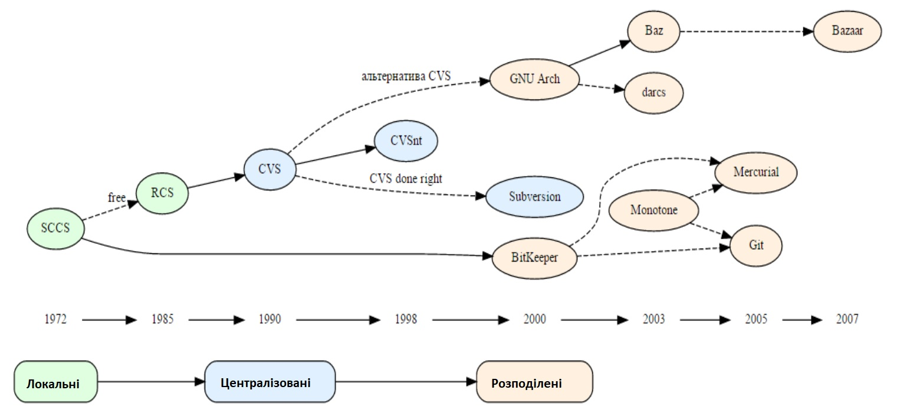

# Вступ. Розвиток систем керування версіями

[Перелік лекцій](README.md)

## Система керування версіями

Система керування версіями (СКВ, англ. source code management, SCM, VCS) — програмний інструмент для керування версіями одиниці інформації: початкового коду програми, скрипту, веб-сторінки, вебсайту, 3D-моделі, текстового документу тощо.

Система керування версіями — інструмент, який дозволяє одночасно, не заважаючи один одному, проводити роботу над груповими проєктами.

Системи керування версіями зазвичай використовуються при розробці програмного забезпечення для відстеження, документування та контролю над поступовими змінами в електронних документах: у сирцевому коді застосунків, кресленнях, електронних моделях та інших документах, над змінами яких одночасно працюють декілька людей.

Кожна версія позначається унікальною цифрою чи літерою, зміни документу занотовуються. Зазвичай також зберігаються дані про автора зробленої зміни та її час.

Інструменти для контролю версій входять до складу багатьох інтегрованих середовищ розробки.

Існують два основні типи систем керування версіями: з централізованим сховищем та розподіленим.

Система збереження історії редагувань статей, що застосовується у Вікіпедії є прикладом системи керування версіями.

## Copy-paste

Відомий метод при застосуванні до даної задачі може виглядати наступним чином: будемо називати файли за шаблоном filename_{version}, можливо з додаванням часу створення або зміни.

Даний спосіб є дуже простим, але він схильний до різних помилок: можна випадково змінити не той файл, можна скопіювати не з тієї директорії (адже саме так переносяться файли в цій моделі).

## Для чого потрібні VCS?

* Зберігання всієї історії змін
* Опис причин всіх вироблених змін
* Відкат змін, якщо щось пішло не так
* Пошук причини і відповідального за появи помилок в
програмі
* Спільна робота групи над одним проектом
* Можливість змінювати код, не заважаючи роботі інших
користувачів

## Термінологія VCS

* Репозиторий — сховище версій — в ньому
зберігаються всі документи разом з історією їх
зміни та іншої службовою інформацією.
* Робоча копія — копія проекту, пов'язана з
репозиторієм
* Транк (trunk) — основна гілка коду
* Бранч (branch) — відгалуження
* Чекін (Check in (submit, commit)) — відправлення коду в репозиторій
* Чекаут (Check out) — одержання зміни з репозиторію
* Конфлікти — виникають, коли кілька людей правлять один і той же код, конфлікти можна вирішувати
* Патч — шматок з записаними змінами, які можна застосувати до сховища з кодом

## Історія розвитку

Покоління розвитку СКВ

|Покоління|Мережна архітектура|Обробка файлу|Конкурентність|Приклади|
|:--|:--|:--|:--|:--|
|Перше|Локальна|Один файл за раз|Блокування файлу|RCS, SCCS|
|Друге|Централізована|Багатофайлова|Злиття до фіксації|CVS, SourceSafe, Subversion, Team Foundation Server|
|Третє|Розподілена|Набори змін|Фіксація до злиття|Bazaar, Git, Mercurial|

Сорокарічна історія інструментів контролю версій показує постійний рух до більшої паралельності роботи.

* У інструментах першого покоління паралельна розробка оброблялася виключно за допомогою блокування файлу. Одночасно над файлом може працювати лише одна особа. Фактично, паралельність відсутня.
* Інструменти другого покоління лають більше можливостей для паралельної модифікації одного проєкту. Користувачі повинні об’єднати поточні версії у свою роботу, перш ніж їм буде дозволено робити фіксацію.
* Інструменти третього покоління дозволяють об’єднувати та фіксувати окремі частини роботи членів команди.
